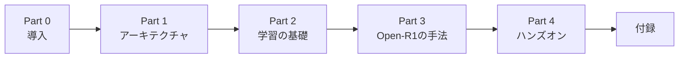

# 第0章 まえがき・本書の読み方

## 0.1 本書が扱うもの

2025年1月、中国の AI スタートアップ **DeepSeek** が公開した
[DeepSeek-R1](https://arxiv.org/abs/2501.12948) は、
OpenAI o1 に匹敵する **推論（reasoning）性能** を持ちながら、
モデル重みを MIT License で公開したことで世界的な注目を集めました。
しかし重みだけでは「どうやって作ったのか」は再現できません。

Hugging Face が始めた **Open-R1** プロジェクトは、
この R1 の **データセットと学習コードを完全オープンに再構築する** 試みです。
本書はこの Open-R1 を入り口に、

1. 近年のLLMを支える **アーキテクチャ要素**（Transformer・MoE・RoPE）
2. 推論モデルを仕上げるための **学習パイプライン**（事前学習・SFT・RL・蒸留）
3. Open-R1 が採用する **GRPO** という新しい強化学習アルゴリズム

を順番に学びます。

## 0.2 対象読者

本書は次のような読者を想定しています。

- Python の基礎と `numpy` / `torch` の扱いに慣れている
- Transformer という言葉は知っているが、コードレベルでの理解は曖昧
- 強化学習・方策勾配・PPO といった話題は未経験もしくは苦手意識がある
- `transformers` や `trl` ライブラリを使ったことはあるかもしれないが、自分で学習ループを回した経験は少ない

LLMの推論モデルを「なんとなく使えている」状態から、
**「なぜこの設計なのか・何を最適化しているのか」を自分の言葉で説明できる** 状態へ引き上げることが目標です。

## 0.3 本書を読むのに必要な前提知識

| 領域 | 必要レベル | 補足 |
|---|---|---|
| Python | 中級 | デコレータ・dataclass・型ヒント程度まで |
| 線形代数 | 基礎 | 行列積・内積・ノルム |
| 確率 | 基礎 | 期待値・分散・対数尤度 |
| 深層学習 | 基礎 | backprop・optimizer（Adam 程度） |
| PyTorch | 基礎 | `nn.Module` を書いたことがある |
| 強化学習 | **不要** | 本書の中で必要な範囲を解説します |

## 0.4 本書の構成と学習順序

DrRacket-Japanese-Tutorial の流儀にならい、本書は6つのパートに分かれています。



- **Part 0-2 は順に読むことを強く推奨**します。後の章が前の章の用語と数式に依存するためです。
- Part 3 の各章は比較的独立しているので、興味のある順に拾い読みしても構いません。
- Part 4 は GPU 環境が必要になりますが、読むだけでも要点はつかめる構成です。

## 0.5 記法の約束

### シェルと REPL

```bash
$ pip install transformers
```

```python
>>> from transformers import AutoTokenizer
>>> tok = AutoTokenizer.from_pretrained("deepseek-ai/DeepSeek-R1-Distill-Qwen-1.5B")
```

### 数式

数式はインラインは `$x$`、独立式は `$$...$$` で記述します。GitHub 上では数式が描画されます。

$$
\mathcal{L}_{\text{CE}} = -\sum_t \log p_\theta(y_t \mid y_{<t}, x)
$$

### コールアウト

> 💡 **Tip**  補足情報。読み飛ばしても理解には影響しません。

> ⚠️ **Warning**  つまずきやすい落とし穴、典型的なミスなど。

> 🧪 **手を動かしてみよう**  各章末の演習です。必ず自分で手を動かしてください。

## 0.6 必要な環境

詳細は **第11章** で構築しますが、全体像としては次の通りです。

| 章範囲 | 必要環境 |
|---|---|
| 0〜6章 | 読むだけなら何でも OK／紙とペンでも可 |
| 7〜10章 | Python 実行環境（Colab可） |
| 11章 | Linux / macOS + Python 3.11 + CPU |
| 12章 | Linux + CUDA + 24GB以上のGPU（Colab Pro A100推奨） |

## 0.7 本書で扱わないこと

- **LLMアプリ開発（RAG、エージェント、関数呼び出し等）**: 推論モデルの **作る側** にフォーカスします
- **Prompt Engineering**: 推論モデルに効くプロンプトは触れますが、網羅はしません
- **量子化・デプロイ・推論最適化**: GGUF化・vLLM本番運用などは別書の題材です
- **マルチモーダル（画像・音声）**: 本書は言語モデルに限定します

## 0.8 さあ、はじめよう

準備ができたら、[第1章](ch01.md) で Open-R1 と DeepSeek-R1 の全体像を俯瞰します。
「推論モデルとは何か」「Open-R1 は何を再現しようとしているのか」を1枚の地図にまとめるところから始めましょう。

---

[→ 第1章 LLM と Open-R1 の全体像](ch01.md)
