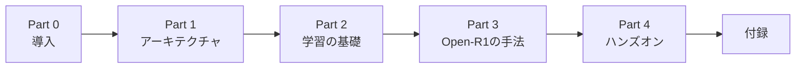

# 第0章 まえがき・本書の読み方

## 0.1 本書が扱うもの

2025年1月、中国の AI スタートアップ **DeepSeek** が公開した
[DeepSeek-R1](https://arxiv.org/abs/2501.12948) は、
OpenAI o1 と同水準の **推論（reasoning）性能** を数学・コード系ベンチマークで示しながら、
モデル重みを MIT License で公開したことで世界的な注目を集めました。
しかし重みだけでは「どうやって作ったのか」は再現できません。

Hugging Face が始めた **Open-R1** プロジェクトは、
この R1 の **データセットと学習コードを完全オープンに再構築する** 試みです。
本書はこの Open-R1 を入り口に、

1. 近年のLLMを支える **アーキテクチャ要素**（Transformer・MoE・RoPE）
2. 推論モデルを仕上げるための **学習パイプライン**（事前学習・SFT・RL・蒸留）
3. Open-R1 が採用する **GRPO** という新しい強化学習アルゴリズム

を順番に学びます。

## 0.2 対象読者

本書は次のような読者を想定しています。

- Python の基礎と `numpy` / `torch` の扱いに慣れている
- Transformer という言葉は知っているが、コードレベルでの理解は曖昧
- 強化学習・方策勾配・PPO といった話題は未経験もしくは苦手意識がある
- `transformers` や `trl` ライブラリを使ったことはあるかもしれないが、自分で学習ループを回した経験は少ない

LLMの推論モデルを「なんとなく使えている」状態から、
**「なぜこの設計なのか・何を最適化しているのか」を自分の言葉で説明できる** 状態へ引き上げることが目標です。

## 0.3 本書を読むのに必要な前提知識

| 領域 | 必要レベル | 補足 |
|---|---|---|
| Python | 中級 | デコレータ・dataclass・型ヒント程度まで |
| 線形代数 | 基礎 | 行列積・内積・ノルム |
| 確率 | 基礎 | 期待値・分散・対数尤度 |
| 深層学習 | 基礎 | backprop・optimizer（Adam 程度） |
| PyTorch | 基礎 | `nn.Module` を書いたことがある |
| 強化学習 | **不要** | 本書の中で必要な範囲を解説します |

## 0.4 本書の構成と学習順序

DrRacket-Japanese-Tutorial の流儀にならい、本書は6つのパートに分かれています。



### 3つの読み方

目的別に次の3ルートを推奨します（詳細は [README](../README.md#-3つの読み方) を参照）。

- **A 理論重視**: 0→1→2→…→10（順送り）
- **B 実装重視**: 0→1→5→6→7→11→12（アーキテクチャは必要時に参照）
- **C Open-R1 読解重視**: 1→7→8→9→10→11→12

どのルートでも、**第7章（GRPO）と第8章（報酬設計）** は本書の中核なので飛ばさないでください。
それ以外の章は、**読む → 詰まる → 参照** で行き来する想定で書いています。

## 0.5 読者が詰まりやすいポイント（先回り）

過去に同じ題材を教えた経験から、以下の3つで足が止まりやすいことがわかっています。
自分の混乱を「異常」と感じないための予防接種だと思って読んでください。

### 詰まりポイント 1: 数式より **記号の意味づけ** で詰まる

$\pi_\theta, A, \rho, V, \beta, G, \varepsilon \ldots$ と記号が一気に増えます。
式そのものよりも「この記号は何を指していて、何次元で、どのくらいの大きさなのか」が曖昧なまま進むと、章をまたいで混乱します。
**次節の「頻出記号表」** を必要に応じて開いてください。

### 詰まりポイント 2: RL は **「時系列制御」より「LLM を方策として見る」発想転換** で詰まる

RL入門書に出てくるロボット・ゲームのイメージを持ち込むと、LLMの RL は違和感だらけです。
本書は **「LLM はもともと確率分布を吐く方策である」** という視点を明示的に導入します（第6章冒頭）。
そこを掴むまでは、**「状態＝これまでの文字列、行動＝次のトークン、エピソード＝1応答」** の対応だけを頼りに読み進めてください。

### 詰まりポイント 3: 実装では **理論より環境差分** で詰まる

`transformers` のバージョン、`trl` の API 変更、CUDA・bf16 対応、OOM、HFトークンの権限…
理論を追いきれたのに「なぜか動かない」で離脱するケースが最も多いです。
第11章に **よくあるエラー早見表** を用意しています。動かない時はそこへ先にジャンプしてください。

## 0.6 本書で頻出する記号（早見表）

章をまたいで何度も出てくる記号を一覧にまとめます。
詰まったらここに戻ってください。

| 記号 | 意味 | 主に登場する章 |
|---|---|---|
| $x$ | プロンプト（入力） | 5〜12 |
| $y, y_t$ | 応答全体・応答の第 $t$ トークン | 5〜12 |
| $\theta$ | 学習対象のモデルパラメータ | 5〜12 |
| $\pi_\theta$ | 方策（＝LLM そのもの） | 6〜12 |
| $\pi_\text{ref}$ | 参照方策（通常は SFT モデル） | 6, 7 |
| $s, a$ | 状態（=文脈）・行動（=次トークン） | 6 |
| $R, r_\phi$ | 報酬・報酬モデル | 6〜8 |
| $A$ | アドバンテージ（報酬−ベースライン） | 6, 7 |
| $V_\psi$ | 価値関数（PPO が持ち、GRPO は持たない） | 6, 7 |
| $\rho$ | 新旧方策の確率比 $\pi_\theta / \pi_{\theta_\text{old}}$ | 6, 7 |
| $\varepsilon$ | PPO/GRPO のクリップ幅（典型 0.1〜0.2） | 6, 7 |
| $\beta$ | KL ペナルティ係数（典型 0.01〜0.04） | 6, 7 |
| $G$ | GRPO で同一プロンプトから生成するサンプル数 | 7 |
| $d$ | モデルの隠れ次元 | 2〜4 |
| $T$ | 系列長（トークン数） | 2〜4 |

## 0.7 本書での用語の固定

同じ概念を指す英日の呼び方を、本書では次のように統一します。

| 本書での表記 | 同義のよく見る呼び方 |
|---|---|
| 推論モデル | reasoning model |
| 思考過程 | CoT, chain-of-thought, 推論軌跡, reasoning trace |
| 報酬ハック | reward hacking |
| 蒸留 | distillation, knowledge distillation, KD |
| 正解報酬 | accuracy reward, correctness reward |
| 書式報酬 | format reward |
| 方策 | policy |
| アドバンテージ | advantage |

## 0.8 記法の約束

### シェルと REPL

```bash
$ pip install transformers
```

```python
>>> from transformers import AutoTokenizer
>>> tok = AutoTokenizer.from_pretrained("deepseek-ai/DeepSeek-R1-Distill-Qwen-1.5B")
```

### 数式

数式はインラインは `$x$`、独立式は `$$...$$` で記述します。GitHub 上では数式が描画されます。

$$
\mathcal{L}_{\text{CE}} = -\sum_t \log p_\theta(y_t \mid y_{<t}, x)
$$

### コールアウト

> 💡 **Tip**  補足情報。読み飛ばしても理解には影響しません。

> ⚠️ **Warning**  つまずきやすい落とし穴、典型的なミスなど。

> 🧪 **手を動かしてみよう**  各章末の演習です。必ず自分で手を動かしてください。

## 0.9 必要な環境

詳細は **第11章** で構築しますが、全体像としては次の通りです。

| 章範囲 | 必要環境 |
|---|---|
| 0〜6章 | 読むだけなら何でも OK／紙とペンでも可 |
| 7〜10章 | Python 実行環境（Colab可） |
| 11章 | Linux / macOS + Python 3.11 + CPU |
| 12章 | Linux + CUDA + 24GB以上のGPU（Colab Pro A100推奨） |

## 0.10 本書で扱わないこと

- **LLMアプリ開発（RAG、エージェント、関数呼び出し等）**: 推論モデルの **作る側** にフォーカスします
- **Prompt Engineering**: 推論モデルに効くプロンプトは触れますが、網羅はしません
- **量子化・デプロイ・推論最適化**: GGUF化・vLLM本番運用などは別書の題材です
- **マルチモーダル（画像・音声）**: 本書は言語モデルに限定します

## 0.11 さあ、はじめよう

準備ができたら、[第1章](ch01.md) で Open-R1 と DeepSeek-R1 の全体像を俯瞰します。
「推論モデルとは何か」「Open-R1 は何を再現しようとしているのか」を1枚の地図にまとめるところから始めましょう。

---

[→ 第1章 LLM と Open-R1 の全体像](ch01.md)
