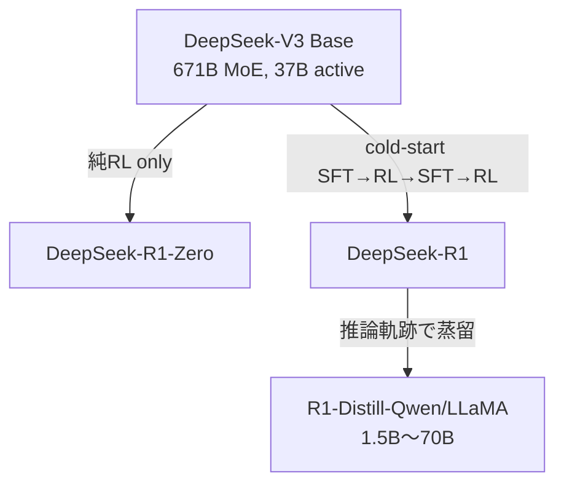
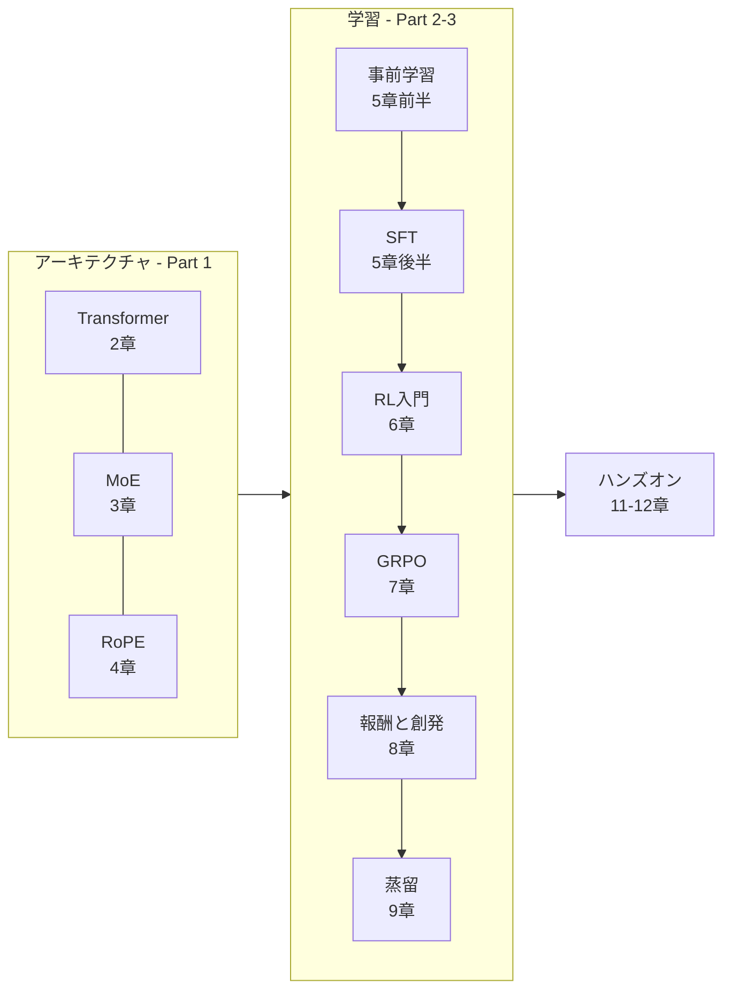

# 第1章 LLM と Open-R1 の全体像

本章では、**推論モデル**とは何か、
DeepSeek-R1 / R1-Zero はどのように作られたのか、
そして Open-R1 はどこを「オープンに」しようとしているのかを俯瞰します。

## 1.1 「推論モデル」とは

2024年9月、OpenAI は **o1** を発表しました。o1 は従来のチャットモデルと違い、
回答の前に `<thinking>...</thinking>` に相当する **長い思考過程** を生成することで、
数学オリンピック・博士号レベルのQA・競技プログラミングといった
**多段階推論タスク** の精度を大きく伸ばしました。

こうした *生成時に自分で Chain-of-Thought（CoT）を長く書き、最後に答える* モデルを、本書では

> **推論モデル（reasoning model）**

と呼びます。DeepSeek-R1 は **推論モデルを完全オープンウェイトで出した最初の例** であり、
その訓練レシピは以下の論文にまとまっています。

- 論文: *DeepSeek-R1: Incentivizing Reasoning Capability in LLMs via Reinforcement Learning* ([arXiv:2501.12948](https://arxiv.org/abs/2501.12948))

## 1.2 R1 の系譜：R1-Zero / R1 / R1-Distill

DeepSeek は実際には **3種類のモデル** を同時に発表しました。

### R1-Zero — 教師なしで推論能力が“創発”する驚異

- 事前学習済みの **DeepSeek-V3-Base** から、**SFTを一切行わず** 直接RLだけで学習
- RLアルゴリズムは **GRPO**（第7章）
- 報酬は **ルールベース**（答えが合っているか・`<think>` タグ書式を守っているか）のみ（第8章）
- **学習中に自発的に "Wait, let me reconsider..." のような自己修正が出現**する
  — これが論文中で **"aha moment"** と呼ばれる現象

### R1 — 実用的な会話・読みやすさを両立

R1-Zero は推論力は強いが、途中思考が読みにくかったり言語混じりになる問題がありました。
そこで R1 は、以下のような **多段階** のレシピで訓練されます。

1. **Cold-start SFT**: 少量の高品質 CoT データで R1-Zero より前にウォームアップ
2. **Reasoning-oriented RL**: R1-Zero と同じ GRPO で推論能力を伸ばす
3. **Rejection Sampling + SFT**: 2 から大量サンプルし、正解だけ残して SFT
4. **最終 RL**: 役立ち度・無害性・指示追従を含めた総合 RL

### R1-Distill — 小型モデルへの知識移転

最終的な R1 が書いた推論軌跡を **教師データ** として、
Qwen2.5 や Llama-3 ベースの小型モデル（1.5B / 7B / 8B / 14B / 32B / 70B）に
**教師あり学習（SFT）** で焼き込んだのが R1-Distill シリーズです。
驚くべきは、**小型の Distill モデルでも多くのベンチマークで GPT-4o を上回る** こと。

## 1.3 Open-R1 が埋める “穴”

DeepSeek-R1 はウェイトこそ公開されたものの、次の情報が公開されていません。

- 学習データ（SFTデータ・RL用プロンプト・報酬検証器の実装詳細）
- 正確な学習スクリプト・ハイパーパラメータ
- 評価スクリプト

これでは *再現* ができません。そこで Hugging Face は
**open-r1** リポジトリを立ち上げ、以下の **3ステップ** で R1 を再構築しようとしています。

| Step | 目標 | 手段 |
|---|---|---|
| 1 | R1-Distill を再現 | R1 から蒸留した高品質 CoT で小型モデルを SFT |
| 2 | R1-Zero を再現 | ベースモデルに対して GRPO だけで純RL |
| 3 | R1 を再現 | Base → SFT → RL → … の多段階パイプライン |

プロジェクト進捗はブログ記事として公開されており、本書執筆時点で主要な成果は次の通りです。

- **OpenR1-Math-220k**: NuminaMath の問題 220K 個に R1 の推論軌跡を付けた SFT データ
- **CodeForces-CoTs**: 競技プログラミング問題 10K + 解答 100K
- **Mixture-of-Thoughts**: 数学・コード・理科を混ぜた計 350K 件の検証済み推論データ
- **OpenR1-Distill-7B**: 上記で学習した 7B モデル（DeepSeek の 7B Distill に匹敵）

## 1.4 本書の「地図」

本書の各章がLLMのパイプラインのどこに対応するかを示します。

第2章からは **アーキテクチャ側** を順に見ていきます。
Transformer の基本ブロックをおさらいしたら、DeepSeek-V3 が採用した
Mixture-of-Experts と Rotary Positional Embeddings を取り上げます。

## 1.5 この章のキーワード

- **推論モデル (reasoning model)**: 回答前に長い CoT を生成するLLM
- **R1-Zero**: SFTなしで純RLだけで推論能力を得たモデル
- **R1**: SFT・RLを多段階で組み合わせた実用モデル
- **R1-Distill**: R1の推論軌跡で蒸留した小型モデル
- **GRPO**: Group Relative Policy Optimization（第7章で詳説）
- **ルールベース報酬**: 答え一致・書式チェックのみで与える報酬（第8章）
- **"aha moment"**: 学習中に自発的な自己修正が現れる現象

## 🧪 手を動かしてみよう

実際にコードを書く前に、「地図」を自分の言葉で描き直してみましょう。

1. **推論モデルと通常のチャットモデルの違い** を、入力／出力／訓練データの観点から3行以内で説明してみてください。
2. DeepSeek-R1 論文の Abstract を読み、**本章で触れた "R1-Zero / R1 / R1-Distill"** がそれぞれ Abstract のどこに対応するか、該当する英文を3箇所マークしてください。
3. `huggingface/open-r1` リポジトリの `README.md` を開き、**Step 1〜3** の記述を本章のTableと見比べて差分を書き出してください（本書は執筆時点の情報です）。

> 💡 **Tip**  「自分の言葉で再構成する」ことは、推論モデルが自分の CoT を見直すのと同じ要領の学習手段です。

---

[← 第0章 まえがき](ch00.md) ｜ [→ 第2章 Transformer の骨格](ch02.md)
