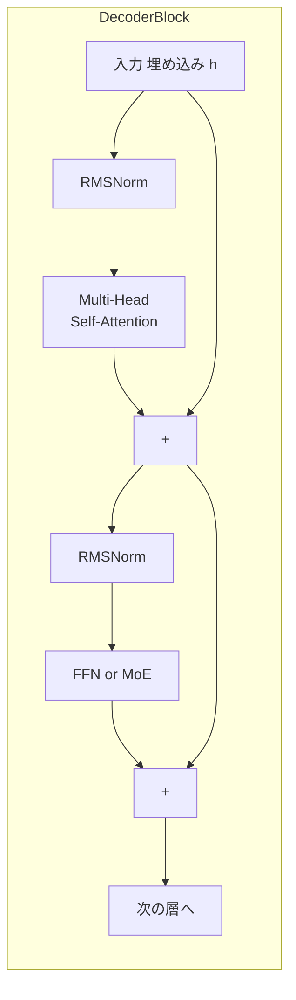

# 第2章 Transformer の骨格

> **この章の立ち位置**
> 第3章以降で学ぶ MoE・RoPE・MLA はすべて
> 「Transformer のどこを、どう置き換えたか」という **差分** として語られます。
> そのため、差分の **基準となる最小構成** を先に押さえておくのが本章の目的です。
> ここで扱う式と擬似コードは以降の章で何度も参照します。

R1 も o1 も、中身は基本的には **デコーダ型 Transformer** です。
本章では、Attention → FFN → 残差接続 → 正規化 という Transformer の最小単位を、
PyTorch の擬似コードレベルで組み立てながら確認します。

## 2.1 大きな構図

デコーダ型 Transformer は **「同じ形のブロックをひたすら重ねる」** 設計です。
DeepSeek-R1 の元となる DeepSeek-V3 では、このブロックが **61 段** 積まれています。



擬似コードで書くと次のようになります。いわゆる **Pre-LN** 構造です。

```python
class Block(nn.Module):
    def forward(self, x):
        x = x + self.attn(self.norm1(x))   # Attention サブレイヤ
        x = x + self.ffn (self.norm2(x))   # FFN サブレイヤ
        return x
```

## 2.2 埋め込みとトークン化

入力文はまず **トークナイザ**（BPE / Unigram / SentencePiece 等）で整数 ID 列に変換されます。
Qwen 2.5 系では語彙サイズ約 **151,936**。これを `nn.Embedding` で $d_{\text{model}}$ 次元のベクトルに埋め込みます。

```python
>>> from transformers import AutoTokenizer
>>> tok = AutoTokenizer.from_pretrained("Qwen/Qwen2.5-1.5B")
>>> ids = tok("素数を3つ挙げよ", return_tensors="pt").input_ids
>>> ids.shape, ids[:, :6]
(torch.Size([1, 7]), tensor([[104837,  18493,  15946, ...]]))
```

> 💡 **Tip**  LLMの埋め込み層は `lm_head` と **重みを共有（tie）** することが多く、
> 語彙サイズ × $d_{\text{model}}$ の行列が入力にも出力にも使われます。

## 2.3 Self-Attention のしくみ

### Attention の直感

Attention の出力は、各位置 $t$ において **「文脈中の他の位置の表現を重み付き平均したもの」** です。
つまり各トークンは **自分の周囲を一度見渡し、関係ありそうな位置の情報を混ぜ込む**。
これを層を重ねるほど、広くて複雑な文脈を集約できるようになります。

### 2.3.1 Q, K, V への射影

入力列 $H \in \mathbb{R}^{T \times d}$ から、3本の学習可能行列で

$$
Q = H W_Q,\quad K = H W_K,\quad V = H W_V
$$

を作ります。$T$ はトークン数、$d$ は次元。
Q / K / V の役割を日常的な比喩でまとめると次の通り。

| 記号 | 直感的な役割 | 主語は誰か |
|---|---|---|
| $Q$ (query) | 「自分が今、何を知りたいか」という問い合わせベクトル | 自分 |
| $K$ (key) | 「私はこういう情報を持っています」という見出し | 相手の位置 |
| $V$ (value) | 実際に取り出される内容物 | 相手の位置 |

$Q$ と $K$ の内積が **どの位置がどれくらい関係ありそうか** を決め、
その重みで **$V$ を加重平均** することで「関係ある所から関係ある分だけ情報を持ってくる」 操作が実現されます。

### 2.3.2 スコアと Softmax

$$
\text{Attn}(Q,K,V) = \mathrm{softmax}\!\Big(\tfrac{QK^\top}{\sqrt{d_k}} + M \Big) V
$$

- $d_k$ はヘッド次元。$\sqrt{d_k}$ で割るのは分散爆発を防ぐスケーリング
- $M$ は **causal mask**: 未来を見ないように上三角を $-\infty$ にする

```python
scores = Q @ K.transpose(-1, -2) / math.sqrt(d_k)
scores = scores.masked_fill(causal_mask, float("-inf"))
attn   = scores.softmax(-1)
out    = attn @ V
```

### 2.3.3 Multi-Head

一つの大きな $d$ 次元 Attention を計算するより、
**$h$ 個の小さな Attention を並列** に計算して最後に結合した方が表現力が上がるというのが multi-head の発想です。

なぜ嬉しいのか、一言で言うと:

> **ヘッドごとに異なる関係性を並列に拾える。**
> 例えば「直前の動詞は何か」を追うヘッド、「主語との一致」を追うヘッド、
> 「段落全体の話題」を追うヘッドなどが、同じトークン列に対して同時に働く。

$$
\text{MHA}(H) = \text{Concat}(\text{head}_1, \ldots, \text{head}_h) W_O
$$

> 💡 **Tip**  推論効率のため、**Grouped-Query Attention (GQA)** や DeepSeek の
> **Multi-head Latent Attention (MLA)** では、K/V の数を Q より減らしています。
> これにより KV キャッシュが大幅に削減されます。

## 2.4 FFN（フィードフォワード）

Attention ブロックの後には **位置ごとに独立に** 適用する 2 層 MLP が入ります。
現代LLMは `GELU` ではなく **SwiGLU** がデファクトです。

$$
\text{SwiGLU}(x) = (x W_1 \odot \mathrm{Swish}(x W_2)) W_3
$$

- $W_1, W_2 \in \mathbb{R}^{d\times d_{ff}}$、$W_3 \in \mathbb{R}^{d_{ff}\times d}$
- Swish(x) = $x\,\sigma(x)$、$\odot$ はアダマール積
- 内部次元 $d_{ff}$ は通常 $d$ の $\sim$2.67〜4倍

```python
class SwiGLU(nn.Module):
    def __init__(self, d, d_ff):
        super().__init__()
        self.w1 = nn.Linear(d, d_ff, bias=False)
        self.w2 = nn.Linear(d, d_ff, bias=False)
        self.w3 = nn.Linear(d_ff, d, bias=False)
    def forward(self, x):
        return self.w3(self.w1(x) * F.silu(self.w2(x)))
```

第3章で見る **MoE** は、この FFN を「複数のエキスパートから選んで使う」構造に差し替える拡張です。

## 2.5 正規化：LayerNorm から RMSNorm へ

初期の Transformer は LayerNorm でしたが、
LLaMA 以降のモデルは **RMSNorm** を採用しています。

$$
\mathrm{RMSNorm}(x) = \frac{x}{\sqrt{\frac{1}{d}\sum_i x_i^2 + \varepsilon}} \odot g
$$

- 平均を引かない（中心化しない）ので計算量が少し軽い
- 学習可能ゲイン $g\in\mathbb{R}^d$ のみ、バイアス無し

```python
class RMSNorm(nn.Module):
    def __init__(self, d, eps=1e-6):
        super().__init__()
        self.g = nn.Parameter(torch.ones(d))
        self.eps = eps
    def forward(self, x):
        rms = x.pow(2).mean(-1, keepdim=True).add(self.eps).rsqrt()
        return x * rms * self.g
```

## 2.6 ブロックを積むとモデルになる

最後に出力側では、最終ブロック出力を **RMSNorm → lm_head(=Embedding の転置)** に通し、
語彙サイズのロジットを得ます。Softmax を掛ければ **次トークン分布** です。

```python
def forward(self, ids):
    h = self.embed(ids)
    for blk in self.blocks:
        h = blk(h)
    h = self.final_norm(h)
    logits = h @ self.embed.weight.T   # weight tying
    return logits
```

この全体像だけ押さえておけば、3章以降の **MoE** や **RoPE** は
「この Transformer ブロックの一部をどう置き換えたか」という差分として理解できます。

## 2.7 DeepSeek-V3 / R1 の規模感

数字で覚えるとイメージがしやすくなります。

| 項目 | 値 |
|---|---|
| 総パラメータ | 671 B |
| 1トークン当たり活性パラメータ | 37 B |
| 層数 | 61（最初の3層は dense, 残りは MoE） |
| 隠れ次元 $d$ | 7168 |
| ヘッド数 | 128 |
| 語彙サイズ | 128,000 |
| 最大コンテキスト | 128 K |

37B しかアクティブにならない理由は、次章の **Mixture of Experts** にあります。

## 🧪 手を動かしてみよう

1. `torch` で「$d=64$, ヘッド数 $h=4$, 系列長 $T=10$」の Single-Block
   Transformer を書き、ランダムな `ids` を通して `(batch, T, vocab)` の logits が返ることを確認してください。
   解答例は [`examples/ch02/tiny_transformer.py`](../examples/ch02/tiny_transformer.py) にあります。

2. 上記ブロックの FFN を `nn.GELU` 版と `SwiGLU` 版で実装し、
   パラメータ数が 1.5 倍程度に増えることを確認してみましょう。

3. 既存の `Qwen/Qwen2.5-0.5B` を `transformers` で読み込み、
   `model.print_trainable_parameters()` でブロック数と $d_{model}$ を確認。
   本章で述べた構造と一致していますか？

---

[← 第1章 全体像](ch01.md) ｜ [→ 第3章 Mixture of Experts](ch03.md)
