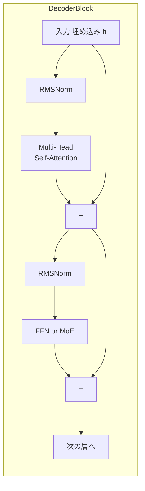

# 第2章 Transformer の骨格

> **この章の立ち位置**
> 第3章以降で学ぶ MoE・RoPE・MLA はすべて
> 「Transformer のどこを、どう置き換えたか」という **差分** として語られます。
> そのため、差分の **基準となる最小構成** を先に押さえておくのが本章の目的です。
> ここで扱う式と擬似コードは以降の章で何度も参照します。

R1 も o1 も、中身は基本的には **デコーダ型 Transformer** です。
つまり R1 の「推論能力」は魔法のような新アーキテクチャから生まれたものではなく、
**2017 年に提案された Transformer という枠組みを徹底的にスケールさせ、
その一部を差し替え・改良することで到達した結果** だということです。
だからこそ、まず **素の Transformer が何をしているか** を押さえれば、
以降の章に出てくる改良点はすべて「この部分が、こう変わった」という形で整理できます。

本章では、Attention → FFN → 残差接続 → 正規化 という Transformer の最小単位を、
PyTorch の擬似コードレベルで組み立てながら確認します。
数式と擬似コードを並べて示しますが、**式の意味が分からなくても、まず擬似コードを「こう計算している」と追えれば十分** です。
式の背後にある意図や直感は、本文で丁寧に補足していきます。

> 📘 **前提知識**
> - 行列積 $AB$ とベクトルの内積が何をしているか（「似ているほど値が大きくなる」という感覚）
> - PyTorch の `nn.Linear(in, out)` が $y = xW^\top + b$ をしている、くらいの理解
> - これ以上の知識は本章を読み進めるうちに必要な箇所で補足します。

## 2.1 大きな構図

デコーダ型 Transformer は **「同じ形のブロックをひたすら重ねる」** 設計です。
DeepSeek-R1 の元となる DeepSeek-V3 では、このブロックが **61 段** 積まれています。

なぜ「同じ形のブロックを何十段も重ねる」というシンプルな設計が、巨大モデルの標準になったのでしょうか。
直感的には次のように理解できます。

- **1 ブロックあたりの仕事は控えめ**。
  「周囲のトークンを少し見渡して、自分の表現をちょっと更新する」程度のことしかしない。
- **何段も通すうちに、抽象度が徐々に上がっていく**。
  初期層は「文字・単語レベル」の局所的な情報を混ぜるが、
  中層・後層に進むにつれて「文全体の意味」「段落の主題」「推論のための抽象的な関係」に相当する表現が形成されることが、
  さまざまな解析研究で報告されています。
- **同じ形なので実装・最適化・並列化が楽**。
  61 層を一度にメモリに載せきれなくても、層ごとのパイプライン並列や重みシャーディングで分散できます。



擬似コードで書くと次のようになります。いわゆる **Pre-LN** 構造です。

```python
class Block(nn.Module):
    def forward(self, x):
        x = x + self.attn(self.norm1(x))   # Attention サブレイヤ
        x = x + self.ffn (self.norm2(x))   # FFN サブレイヤ
        return x
```

### このわずか 2 行から読み取ってほしい 3 つのこと

初心者が最初に戸惑うのはこの「2 行で書けちゃう本体」です。ここに詰まっている設計思想を順に解きほぐしましょう。

**(1) `x = x + ...` の足し算 — 残差接続（residual connection / skip connection）**

サブレイヤの出力を「そのまま返す」のではなく **「元の x に足す」** のがポイントです。
これは **残差接続** あるいは **スキップコネクション** と呼ばれ、
もともとは画像認識の深層学習（2015 年の ResNet）で「100 層を超えるネットワークを安定して学習する」ために導入された仕組みです。
Transformer はこの発想をそのまま受け継いでいます。

数式で書くと、サブレイヤの変換を $f$ としたとき、各ブロックの出力は

$$
\text{output} = x + f(x)
$$

となります。一見些細な足し算ですが、これが深いモデルの学習を支えています。
ポイントは 3 つあります。

1. **恒等写像（identity）から出発できる**
   サブレイヤが最悪何も有用なことを学習できなかったとしても、
   $f(x) \approx 0$ のままにすれば $x$ がそのまま次の層へ流れていきます。
   つまり各層は「入力を壊さない」ことが保証された状態で学習を始められ、
   「必要に応じて少しずつ $f(x)$ を使って表現を更新していく」という形で振る舞えます。
2. **勾配が深い層まで届く**
   誤差逆伝播では、$x + f(x)$ の微分に「1」の成分が常に残るため、
   勾配が各層で減衰せずに入力側まで届きます。
   スキップ接続が無いと、層を遡るたびに勾配が指数的に小さくなる（勾配消失）・大きくなる（勾配爆発）問題が起きやすく、
   深いモデルは実質的に学習できませんでした。
3. **層を機能単位として扱える**
   各層が「前の層の出力を少しずつ更新する」という差分的な動きをするので、
   層を抜いたり・入れ替えたり・追加したりしても、モデル全体の挙動が大きく崩れません。
   後述の pipeline parallelism（層ごとに GPU を分ける並列化）や、
   LoRA のような追加学習手法、モデル手術（プルーニング・層の抜き差し）などが実用になるのも、
   この「層ごとに緩やかに繋がった」構造のおかげです。

### 大規模言語モデルでの残差接続の意味合い

LLM のスケールになると、残差接続は「学習を可能にする補助輪」以上の役割を担います。
実務的には、次の 3 つの視点で理解しておくと役立ちます。

- **残差ストリーム（residual stream）という見方**
  各トークンのベクトルは、層を通るたびに $x \leftarrow x + f_\ell(x)$ と少しずつ更新されていきます。
  これを時系列のように捉えると、**「入力埋め込みから出力に至る 1 本の情報の流れ（residual stream）」** があり、
  各層の Attention や FFN がそこに情報を "書き込む" ように働いていると見なせます。
  解釈可能性の研究（Anthropic の Transformer Circuits など）では、
  この残差ストリームをモデル解析の軸として、個々のヘッドや FFN ニューロンの役割を読み解いています。
- **層ごとの「振る舞いの緩やかさ」が LLM の性質を作る**
  残差接続により、各層の出力は前の層の出力と近いベクトルになります。
  その結果、LLM には「特定の事実が特定の層付近に現れる」「途中層の表現がそのまま線形分類に使える」といった性質が現れ、
  **Linear probing、early exit、モデルマージ、層単位の量子化** などの技術が成立します。
- **学習の安定性と Pre-LN の組み合わせ**
  深い LLM では、残差ストリームを流れるベクトルのノルムが層を重ねるごとに増大しがちです。
  Pre-LN（各サブレイヤ入力を正規化してから変換する：次項参照）と組み合わせることで、
  サブレイヤへの入力スケールだけは抑えつつ、残差ストリーム本体には情報が足し込まれ続ける、
  という **「幹は太く、枝は穏やかに」** という設計になっています。
  この組み合わせが、GPT-3・LLaMA・DeepSeek-V3 といった数十〜百層規模のモデルを
  安定して事前学習できる基盤になっています。

まとめると、残差接続は単なる実装上のテクニックではなく、
**「Transformer を "同じ形のブロックを何十層も積める" アーキテクチャにしている根幹」** であり、
LLM の学習・解釈・運用のあらゆる場面で前提となる構造です。
以降の章で出てくる MoE・MLA・LoRA などはすべて、この残差ストリームを前提に
「どの層の、何を、どう書き換えるか」という形で議論されます。

**(2) `self.norm1(x)` を先に通す — Pre-LN と Post-LN**

「正規化してから Attention に入れる」この順序を **Pre-LN** と呼びます。
オリジナルの Transformer 論文（2017）は「Attention を通した後に正規化する」**Post-LN** でしたが、
深く積むと学習が不安定になる問題があり、
GPT-2 以降のほぼすべての大規模モデルでは Pre-LN が採用されています。
**入力を正規化してから変換する → スケールが暴れにくい** と覚えておけば十分です。

**(3) サブレイヤは 2 種類だけ — Attention と FFN**

この 2 行の `attn` と `ffn` がすべての計算を担っています。役割分担は:

- **Attention（次節で詳解）**: 「トークンとトークンの間」で情報を混ぜる。文脈の取り込み担当。
- **FFN（2.4 節で詳解）**: 「1 つのトークンの中」で情報を変換する。特徴抽出担当。

この 2 つが層ごとに交互に働くことで、Transformer は
「周りを見る → 自分を更新する」を延々と繰り返す **反復的な情報処理装置** になっています。

## 2.2 埋め込みとトークン化

### なぜトークン化が必要なのか

ニューラルネットは **数値のテンソル** しか処理できません。
したがって「素数を3つ挙げよ」という文字列を直接食わせることはできず、
**文字列 → 整数 ID 列 → ベクトル列** という 2 段階の変換が必要です。

- **文字列 → 整数 ID 列**: トークナイザの仕事
- **整数 ID 列 → ベクトル列**: 埋め込み層（`nn.Embedding`）の仕事

### トークン化：単語でも文字でもない「サブワード」

素朴には「単語ごとに 1 つの ID」と決めたくなりますが、これでは
「未知の単語（造語・専門用語・誤字）は全部 `<unk>` になる」「日本語のように単語境界が曖昧な言語で破綻する」
などの問題が起きます。一方「文字ごとに 1 つの ID」だと系列長が異常に長くなる。

そこで現代の LLM は **サブワード（subword）** 単位を使います。
代表的なアルゴリズムが **BPE（Byte Pair Encoding）** や **Unigram LM**、
これらを包んだツールが **SentencePiece** です。おおまかに次のような挙動を取ります。

- 頻出する文字列は 1 トークン（例: `"the"`, `"する"`, `"int"` は 1 トークン）
- 頻出しない文字列はより細かい単位に分解（例: 珍しい固有名詞や絵文字は 2〜数トークンに分割）
- バイト単位で表現するので、**原理的にどんな入力文字列も表せる**（未知語が無い）

Qwen 2.5 系では語彙サイズ約 **151,936**。この「辞書」の大きさが、埋め込み行列の行数になります。

### 埋め込み層：ID 番号をベクトルに変換する

ID 列が手に入ったら、`nn.Embedding` で $d_{\text{model}}$ 次元のベクトルに変換します。
これは実質的には **「語彙サイズ × $d_{\text{model}}$ の行列から、ID 番号の行を取り出す」** だけの操作です。
ランダムに初期化された行列が、学習を通じて
「意味の近いトークンが似たベクトルになる」ように収束していきます。

```python
>>> from transformers import AutoTokenizer
>>> tok = AutoTokenizer.from_pretrained("Qwen/Qwen2.5-1.5B")
>>> ids = tok("素数を3つ挙げよ", return_tensors="pt").input_ids
>>> ids.shape, ids[:, :6]
(torch.Size([1, 7]), tensor([[104837,  18493,  15946, ...]]))
```

7 トークンに分かれたことが `torch.Size([1, 7])` から読み取れます。
「素数」「を」「3」「つ」「挙げ」「よ」のように、漢字・数字・送り仮名の切れ目で分割されていることが多いですが、
トークナイザによって挙動は異なるので、実際に試してみるのが確実です。

> 💡 **Tip**  LLMの埋め込み層は `lm_head` と **重みを共有（tie）** することが多く、
> 語彙サイズ × $d_{\text{model}}$ の行列が入力にも出力にも使われます。
> つまり「トークン → ベクトル」と「ベクトル → トークン分布」を **同じ行列の転置** で行うということです。
> これはパラメータ節約になるだけでなく、
> 「入口と出口で同じ意味空間を使う」ことで学習効率も上がると報告されています。
> 2.6 節のコードで具体的に見ます。

## 2.3 Self-Attention のしくみ

Transformer の心臓部であり、初心者が一番つまずきやすい部分です。
ここでは **「なぜ Attention が必要なのか」から始めて、Q/K/V → Softmax → Multi-Head と順に積み上げていきます**。

### Attention の直感 — なぜ必要なのか

言語を理解するには、**離れた位置のトークン同士を関連付ける** 必要があります。
たとえば次の文を考えてみましょう。

> 「机に置いてあった本を取ろうとしたが、**それ** は重くて持ち上げられなかった。」

「それ」が指すのは「本」です。モデルがこの文を処理するとき、
**「それ」の位置の表現を計算するには「本」の位置の情報が必要** です。
Attention が登場する前に主流だった RNN（LSTM など）は、
文を左から右へ 1 トークンずつ処理するので、離れた単語同士の関係を捉えるのが苦手でした。

Attention の発想はシンプルです:

> **各位置 $t$ の出力を、「文脈中の他の位置の表現を重み付き平均したもの」として作る。**

つまり各トークンは **自分の周囲を一度見渡し、関係ありそうな位置の情報を混ぜ込む**。
RNN のように順番に伝搬する必要がないので、
**どれだけ離れた位置でも 1 ステップで関連付けられる** のが Transformer の強みです。
これを層を重ねるほど、広くて複雑な文脈を集約できるようになります。

### 2.3.1 Q, K, V への射影

Attention の計算は、まず入力を 3 種類の別のベクトルに変換することから始まります。
入力列 $H \in \mathbb{R}^{T \times d}$ から、3本の学習可能行列で

$$
Q = H W_Q,\quad K = H W_K,\quad V = H W_V
$$

を作ります。$T$ はトークン数、$d$ は次元。
なぜ同じ $H$ から 3 種類も作るのでしょうか。**それぞれに別の役割を持たせるため** です。
Q / K / V の役割を日常的な比喩でまとめると次の通り。

| 記号 | 直感的な役割 | 主語は誰か |
|---|---|---|
| $Q$ (query) | 「自分が今、何を知りたいか」という問い合わせベクトル | 自分 |
| $K$ (key) | 「私はこういう情報を持っています」という見出し | 相手の位置 |
| $V$ (value) | 実際に取り出される内容物 | 相手の位置 |

**図書館の比喩** がわかりやすいかもしれません。
- あなた（Q）は「微分方程式の入門書を探している」という問い合わせを持っている。
- 各書棚（K）には「数学 > 解析 > 微分方程式」のような **見出し（タイトル）** が貼ってある。
- 見出しが問い合わせと一致した書棚から、実際の本の中身（V）を取り出して読む。

$Q$ と $K$ の内積が **どの位置がどれくらい関係ありそうか** を決め、
その重みで **$V$ を加重平均** することで「関係ある所から関係ある分だけ情報を持ってくる」 操作が実現されます。

### 2.3.2 スコアと Softmax

数式にするとたった 1 行です。

$$
\text{Attn}(Q,K,V) = \mathrm{softmax}\!\Big(\tfrac{QK^\top}{\sqrt{d_k}} + M \Big) V
$$

式が重いので、**中身を段階的に分解** してみましょう。

1. **$QK^\top$**: 形は $T \times T$。$(i, j)$ 成分は「位置 $i$ の Q と位置 $j$ の K の内積」。
   つまり **「位置 $i$ から見て、位置 $j$ がどれくらい関係ありそうか」のスコア表** です。
2. **$/\sqrt{d_k}$**: 内積は次元が大きいほど絶対値も大きくなりやすく、そのまま softmax すると
   1 つの位置に注意が極端に集中してしまいます。$\sqrt{d_k}$ で割るのは **分散が 1 程度になるようにするスケーリング** です。
3. **$+ M$**: 未来のトークンを見せないための **causal mask**。
   後述の「なぜ必要か」を参照。
4. **$\mathrm{softmax}$**: 各行を「合計 1 の確率分布」に変換します。
   結果のテンソルは $T \times T$ で、$(i, j)$ 成分が「位置 $i$ が位置 $j$ をどれくらい参照するか」の重み。
5. **最後に $V$ を掛ける**: 重み行列 × 値行列 で、各位置の出力が「重み付き平均された V」になります。

- $d_k$ はヘッド次元。$\sqrt{d_k}$ で割るのは分散爆発を防ぐスケーリング
- $M$ は **causal mask**: 未来を見ないように上三角を $-\infty$ にする

**なぜ causal mask が必要なのか？**
LLM は「次トークン予測」で学習します。
位置 $t$ の出力を作るときに未来（位置 $t+1, t+2, \ldots$）を見てしまうと、
「答えをカンニングしてから答えている」ことになり、推論時の挙動と矛盾します。
そこで **未来の位置に相当する softmax 前のスコアを $-\infty$ に設定** し、
softmax 後の重みを 0 にすることで、構造的に「未来を覗けない」ようにします。

```python
scores = Q @ K.transpose(-1, -2) / math.sqrt(d_k)
scores = scores.masked_fill(causal_mask, float("-inf"))
attn   = scores.softmax(-1)
out    = attn @ V
```

初心者は、**`scores.shape == (T, T)`** という点だけでも覚えておくと理解が固まります。
この $T \times T$ の「注意の地図」が、層ごと・ヘッドごとに毎回描かれている、というのが Transformer の動作イメージです。

### 2.3.3 Multi-Head

ここまでの話は「Attention を 1 個計算する」ものでした。
実際の Transformer は、Attention を **複数個並列に** 走らせます。これが **Multi-Head Attention (MHA)** です。

一つの大きな $d$ 次元 Attention を計算するより、
**$h$ 個の小さな Attention を並列** に計算して最後に結合した方が表現力が上がるというのが multi-head の発想です。

具体的には、例えば $d = 512$ で $h = 8$ なら、ヘッド次元は $d_k = 512/8 = 64$ となり、
64 次元の Attention が 8 個独立に走る構成になります。
パラメータ数と計算量は 1 つの $d$ 次元 Attention とほぼ同じですが、表現力は明らかに向上します。

なぜ嬉しいのか、一言で言うと:

> **ヘッドごとに異なる関係性を並列に拾える。**
> 例えば「直前の動詞は何か」を追うヘッド、「主語との一致」を追うヘッド、
> 「段落全体の話題」を追うヘッドなどが、同じトークン列に対して同時に働く。

1 つの大きな Attention は「スコア表」を 1 枚しか持てませんが、
Multi-Head なら **異なる観点の「スコア表」を同時に何枚も持てる** ので、
異なる種類の関係を分業できるイメージです。

最後に各ヘッドの出力を連結し、もう一度線形変換 $W_O$ で混ぜ合わせて次の層に渡します。

$$
\text{MHA}(H) = \text{Concat}(\text{head}_1, \ldots, \text{head}_h) W_O
$$

> 💡 **Tip**  推論効率のため、**Grouped-Query Attention (GQA)** や DeepSeek の
> **Multi-head Latent Attention (MLA)** では、K/V の数を Q より減らしています。
> これにより KV キャッシュが大幅に削減されます。
> 「なぜ KV キャッシュが削減されるのか」「どうして MLA がそれをさらに圧縮できるのか」は、第4・5章で詳しく見ます。

## 2.4 FFN（フィードフォワード）

### FFN の役割 — Attention との分業

Attention ブロックの後には **位置ごとに独立に** 適用する 2 層 MLP が入ります。
「位置ごとに独立に」とは、**同じ重み $W_1, W_2, W_3$ を各位置のベクトルに個別に適用する** という意味で、
位置をまたぐ情報の混合は一切行いません。そこは Attention の仕事です。

> **Attention は位置間で情報を混ぜ、FFN は位置内で情報を変換する。**
> この 2 つが交互に働くことで、Transformer は「文脈を取り込み、取り込んだ情報を加工する」を繰り返します。

FFN は見た目は普通の 2 層 MLP ですが、**実はモデル全体のパラメータの多くがここに集中** しています
（DeepSeek-V3 で言えば、ここを MoE に置き換えることでパラメータ総数を稼いでいるのが第3章のテーマです）。
直感的には、FFN は
「**Attention で集めてきた情報を、そのトークンにとって有用な特徴量に変換する"計算機"**」
の役割を担っていると考えられています。近年の解釈可能性研究では、
FFN を巨大な **key-value メモリ** とみなす見方も提案されています。

### 活性化関数の進化：GELU → SwiGLU

初期の Transformer は活性化関数として ReLU → GELU を使ってきましたが、
現代LLMは `GELU` ではなく **SwiGLU** がデファクトです。
SwiGLU は一見複雑ですが、やっていることは
「通常の 2 層 MLP に、もう 1 つ線形変換を足して **ゲート** としてかけ合わせる」ことです。

$$
\text{SwiGLU}(x) = (x W_1 \odot \mathrm{Swish}(x W_2)) W_3
$$

- $W_1, W_2 \in \mathbb{R}^{d\times d_{ff}}$、$W_3 \in \mathbb{R}^{d_{ff}\times d}$
- Swish(x) = $x\,\sigma(x)$、$\odot$ はアダマール積
- 内部次元 $d_{ff}$ は通常 $d$ の $\sim$2.67〜4倍

**ゲート機構の直感**:
$x W_2$ に Swish を通したものは、要素ごとに「0 〜 1 前後」の重みに相当します。
これを $x W_1$ に掛け合わせることで、
「どの特徴チャネルを通すか・抑えるか」を **データに応じて動的に決められる** ようになります。
LSTM の gate と同じ発想で、通常の MLP より表現力が高く、
同じパラメータ数でもロスが下がることが実験的に示されています。

```python
class SwiGLU(nn.Module):
    def __init__(self, d, d_ff):
        super().__init__()
        self.w1 = nn.Linear(d, d_ff, bias=False)
        self.w2 = nn.Linear(d, d_ff, bias=False)
        self.w3 = nn.Linear(d_ff, d, bias=False)
    def forward(self, x):
        return self.w3(self.w1(x) * F.silu(self.w2(x)))
```

> 📝 **コードのポイント**
> - `bias=False`: 現代 LLM ではバイアスを省くのが標準。パラメータ節約・わずかな高速化・経験的に精度が落ちない、が理由。
> - `F.silu` = Swish。PyTorch では SiLU という名前で呼ばれています。
> - 線形層が **3 つ** あるので、同じ内部次元の通常 MLP より 1.5 倍のパラメータを使います。
>   その代わり、この追加コストでモデル全体のロスが下がるので、総合的には得というのが SwiGLU 採用の動機です。

第3章で見る **MoE** は、この FFN を「複数のエキスパートから選んで使う」構造に差し替える拡張です。
つまり「FFN は 1 つだけ」という仮定が外れ、
**トークンごとに使う FFN を選ぶ** ようになる、というのが MoE の核心です。

## 2.5 正規化：LayerNorm から RMSNorm へ

### なぜ正規化が必要なのか

深いネットワークでは、層を通るたびにベクトルの **スケール（大きさ）** がずれていきます。
あるチャネルだけ値が極端に大きくなると、勾配が爆発したり消滅したり、学習が不安定になります。
そこで **各層の入口で、ベクトルのスケールを揃え直す** のが正規化層の役目です。

> 「学習中、どの層でも入力の大きさがだいたい同じくらいになるように調整する」
> これだけで、深いモデルが安定して学習できるようになる。

### LayerNorm と RMSNorm の違い

初期の Transformer は **LayerNorm**（各ベクトルから平均を引いて、標準偏差で割る）を使っていました。
LLaMA 以降のモデルは **RMSNorm** を採用しています。両者の違いは次のとおり。

| | LayerNorm | RMSNorm |
|---|---|---|
| 平均を引く | する | **しない** |
| 割る値 | 標準偏差 | **二乗平均平方根（RMS）** |
| 学習パラメータ | gain $g$ と bias $b$ | **gain $g$ のみ** |
| 計算コスト | やや重い | 少し軽い |

数式で書くと次のとおり。

$$
\mathrm{RMSNorm}(x) = \frac{x}{\sqrt{\frac{1}{d}\sum_i x_i^2 + \varepsilon}} \odot g
$$

- 平均を引かない（中心化しない）ので計算量が少し軽い
- 学習可能ゲイン $g\in\mathbb{R}^d$ のみ、バイアス無し
- $\varepsilon$ は 0 除算を避けるための小さな定数（普通は $10^{-6}$ や $10^{-5}$）

「平均を引かないと精度は落ちないのか？」という疑問はもっともですが、
**実験的にほとんど差が出ず、代わりに計算が速いので採用された** というのが実情です。
巨大モデルの学習では、わずか数 % の速度差が GPU 数千台分のコストに直結するので、
「同じ精度ならシンプルで速い方を選ぶ」という原則が働きます。

```python
class RMSNorm(nn.Module):
    def __init__(self, d, eps=1e-6):
        super().__init__()
        self.g = nn.Parameter(torch.ones(d))
        self.eps = eps
    def forward(self, x):
        rms = x.pow(2).mean(-1, keepdim=True).add(self.eps).rsqrt()
        return x * rms * self.g
```

> 📝 **コードのポイント**
> - `x.pow(2).mean(-1, keepdim=True)`: 最後の次元（=特徴次元 $d$）について二乗平均を取る。
>   `keepdim=True` で形を $(..., d)$ → $(..., 1)$ に保ち、次の掛け算でブロードキャストできるようにする。
> - `.rsqrt()` = 平方根の逆数。`1 / sqrt(x)` を直接計算するより速い専用演算。
> - `self.g` は学習可能な $d$ 次元ベクトル。**初期値は全 1** で、学習を通じて各チャネルの重要度を調整する。

## 2.6 ブロックを積むとモデルになる

ここまでで、Transformer ブロックを構成する部品（Attention、FFN、RMSNorm、残差接続）がすべて出揃いました。
最後にそれらを繋いで、**トークン列 → 次トークン分布** を出力する完全なモデルに組み立てます。

モデル全体のデータフローは次のとおりです。

1. `ids` （整数 ID の列）を受け取る
2. `embed`（埋め込み層）でベクトル列に変換
3. Transformer ブロックを $L$ 段通して、文脈的な表現を作る
4. 最終 RMSNorm でスケールを整える
5. 語彙全体に対するロジット（softmax 前のスコア）を計算
6. 学習時は正解トークンとのクロスエントロピー、推論時は softmax でサンプリング

この流れをコードにすると、**たった数行** に収まります。

最後に出力側では、最終ブロック出力を **RMSNorm → lm_head(=Embedding の転置)** に通し、
語彙サイズのロジットを得ます。Softmax を掛ければ **次トークン分布** です。

```python
def forward(self, ids):
    h = self.embed(ids)
    for blk in self.blocks:
        h = blk(h)
    h = self.final_norm(h)
    logits = h @ self.embed.weight.T   # weight tying
    return logits
```

### コードを 1 行ずつ読み解く

- `h = self.embed(ids)`: 形は `(batch, T)` → `(batch, T, d)`。ここから後はすべて $d$ 次元ベクトルの世界。
- `for blk in self.blocks: h = blk(h)`: 61 層なら 61 回ループするだけ。形は `(batch, T, d)` のまま。
- `h = self.final_norm(h)`: 最後のブロック出力はそのまま lm_head に渡さず、もう一度 RMSNorm で整える。
- `logits = h @ self.embed.weight.T`:
  - `self.embed.weight` の形は `(vocab, d)`。
  - 転置すると `(d, vocab)` なので、結果は `(batch, T, vocab)`。
  - つまり **各位置ごとに、次に来るトークンの語彙サイズぶんのスコアが出る**。
- `return logits`: softmax はあえてここで取らない。学習時のロス計算（`F.cross_entropy`）が、
  数値安定化のために内部で log-softmax してくれるため。

### weight tying の意味をもう一度

`h @ self.embed.weight.T` の行が **重み共有 (weight tying)** の正体です。
入力側の「ID → ベクトル」変換（`nn.Embedding`）と、
出力側の「ベクトル → 語彙スコア」変換（`lm_head`）は、
本来は別々の大きな行列 $(vocab \times d)$ を持ってもよいのですが、
**同じ行列を使い回す** ことで:

- パラメータ数が約 $vocab \times d$ 個ぶん減る（150K × 1536 ≒ 2 億 3 千万個、無視できない）
- 「同じ意味空間」で入出力を扱えるので、学習が安定し、低頻度トークンの予測精度も上がる

という利点が得られます。GPT-2、LLaMA、Qwen など、現代 LLM のほぼすべてが採用しています。

### 学習と推論での挙動の違い

同じ `forward` 関数でも、使われ方は大きく違います。

- **学習時**: 入力 `ids = [t_0, t_1, ..., t_{T-1}]` を丸ごと食わせ、
  各位置の出力 logits を `[t_1, t_2, ..., t_T]` と比較してロスを計算。
  causal mask のおかげで「位置 $t$ の出力は $t$ までしか見ていない」ので、
  **T 個の予測を 1 回の forward でまとめて学習できる**（これが Transformer 学習の効率の源）。
- **推論時**: 既存の文脈から次のトークンを 1 つサンプリングし、それを末尾に追加してまた forward、を繰り返す。
  素朴にやると毎回全トークンを計算し直すので、実装上は **KV キャッシュ** で過去の K/V を使い回して高速化します
  （第5章で詳しく扱う）。

この全体像だけ押さえておけば、3章以降の **MoE** や **RoPE** は
「この Transformer ブロックの一部をどう置き換えたか」という差分として理解できます。

## 2.7 DeepSeek-V3 / R1 の規模感

ここまで学んだ部品が、実際の DeepSeek-V3 / R1 ではどの規模で組み合わされているのか。
数字で覚えるとイメージがしやすくなります。

| 項目 | 値 |
|---|---|
| 総パラメータ | 671 B |
| 1トークン当たり活性パラメータ | 37 B |
| 層数 | 61（最初の3層は dense, 残りは MoE） |
| 隠れ次元 $d$ | 7168 |
| ヘッド数 | 128 |
| 語彙サイズ | 128,000 |
| 最大コンテキスト | 128 K |

### この数字をどう読むか

- **総パラメータ 671 B vs 活性パラメータ 37 B**:
  モデル全体は 671 B（6710 億）個のパラメータを持つが、
  **1 トークンを処理するときに実際に使われるのはその 5.5 % の 37 B だけ**。
  これを可能にするのが第3章の MoE です。
  「でかいけど計算は軽い」というモデルを作るための工夫です。
- **層数 61**:
  本章の `Block` が 61 回積まれている、と思えばよい。
  最初の 3 層だけは普通の dense FFN で、残りの 58 層は FFN を MoE に置き換えた構造です。
- **隠れ次元 $d = 7168$、ヘッド数 128**:
  1 ヘッドあたりのヘッド次元は $d/h = 7168/128 = 56$。
  本章で扱った Attention を 128 個並列に走らせているイメージ。
  ただし DeepSeek は後述の MLA を使うので、K/V は Q より大幅に小さいベクトルで表現されます。
- **語彙サイズ 128,000**: 2.2 節で見たトークナイザの辞書サイズ。
  埋め込み行列 $128{,}000 \times 7168 \approx 9.2$ 億パラメータを、入口と出口で weight tying して共有。
- **最大コンテキスト 128 K**:
  一度に入力できるトークン数の上限。論文数本ぶんの長さを一度に読める規模。
  ただし Attention の計算量は系列長の 2 乗 ($O(T^2)$) なので、
  単純に素の Attention を使っていたら到底実現できません。第5章で扱う **KV キャッシュ・MLA・長文拡張** の合わせ技で成立しています。

37B しかアクティブにならない理由は、次章の **Mixture of Experts** にあります。
本章で押さえた「dense な Transformer ブロック」を土台にして、
第3章以降で各部品の改良を一つずつ見ていきましょう。

## 🧪 手を動かしてみよう

1. `torch` で「$d=64$, ヘッド数 $h=4$, 系列長 $T=10$」の Single-Block
   Transformer を書き、ランダムな `ids` を通して `(batch, T, vocab)` の logits が返ることを確認してください。
   解答例は [`examples/ch02/tiny_transformer.py`](../examples/ch02/tiny_transformer.py) にあります。

2. 上記ブロックの FFN を `nn.GELU` 版と `SwiGLU` 版で実装し、
   パラメータ数が 1.5 倍程度に増えることを確認してみましょう。

3. 既存の `Qwen/Qwen2.5-0.5B` を `transformers` で読み込み、
   `model.print_trainable_parameters()` でブロック数と $d_{model}$ を確認。
   本章で述べた構造と一致していますか？

---

[← 第1章 全体像](ch01.md) ｜ [→ 第3章 Mixture of Experts](ch03.md)
