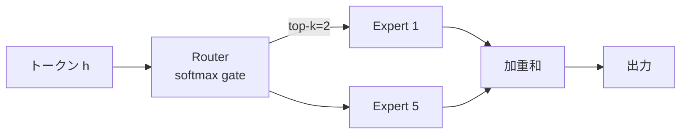

# 第3章 Mixture of Experts (MoE)

DeepSeek-V3 が **671B パラメータなのに推論時 37B しか活性化されない** という仕組みは、
**Mixture of Experts (MoE)** という構造によって実現されています。
本章では MoE のしくみと、DeepSeek 独自の工夫を学びます。

## 3.1 なぜ MoE なのか

dense な Transformer では、全トークンの計算に全パラメータが使われます。
つまり **モデルを大きくすると計算量も比例して増える**。

一方で MoE は

> 「**1トークンが通るのは一部のパラメータ** だけ」

という **条件付き計算（conditional computation）** を導入します。
これにより「パラメータは巨大・計算は軽い」モデルが作れます。

## 3.2 FFN を複数用意する

第2章の FFN 層を思い出してください。
MoE はこの FFN を **$N$ 個のコピー（エキスパート）** として複製し、
各トークンごとに **どのエキスパートを使うか** をルーターが決めます。



数式で書くと、エキスパート $\{E_i\}_{i=1}^N$ とゲート $g_i(x)$ に対して

$$
y = \sum_{i \in \mathrm{TopK}(g(x))} g_i(x) \cdot E_i(x)
$$

- ゲート $g_i(x) = \mathrm{softmax}(x W_g)_i$
- $\mathrm{TopK}$ は上位 $k$ 個のエキスパートだけを選ぶ
- DeepSeek-V3 では **$N=256$ ルーテッドエキスパート + 1 共有エキスパート**, **top-k=8** を採用

> ⚠️ **Warning**  top-k を小さくすると計算は軽くなりますが、
> ルーティングが不安定になり学習が壊れやすくなります。

## 3.3 DeepSeek の 3 つの工夫

### 3.3.1 Shared Expert

すべてのトークンが必ず通る **共通エキスパート** を 1 つ加えます。
これにより、「全トークンに共通する基礎的特徴量」を専用に学習できるようにして、
ルーテッドエキスパートが *尖った* 役割に集中できるようにします。

### 3.3.2 Fine-grained Experts

従来の Mixtral-8x7B は「大きなエキスパート 8 個」の構成でしたが、
DeepSeek-V3 は **エキスパートを小さく切って256個** に増やしています。
「細粒度の専門家を多数」から組み合わせる方が、
同じ計算量でも表現力が上がるという設計判断です。

### 3.3.3 Auxiliary-loss-free ロードバランシング

全トークンが同じエキスパートに集中すると、残りの専門家は遊んでしまいます。
これを防ぐためにルーターの分布を平坦化する **補助損失**（aux loss）が従来は必要でした。
DeepSeek-V3 はこれを避け、**専門家ごとにバイアスを動的調整する** ことで
*学習目的を汚さずに* ロードバランシングします。

```python
# 擬似コード
bias[i] -= step * (load[i] - target)   # 使われすぎた専門家は負にバイアス
```

## 3.4 MoE ブロックの擬似実装

前章の `Block` の FFN 部分だけ差し替えると MoE ブロックになります。

```python
class MoEBlock(nn.Module):
    def __init__(self, d, d_ff, n_experts, top_k):
        super().__init__()
        self.norm1 = RMSNorm(d); self.attn = MHA(d)
        self.norm2 = RMSNorm(d)
        self.router = nn.Linear(d, n_experts, bias=False)
        self.experts = nn.ModuleList([SwiGLU(d, d_ff) for _ in range(n_experts)])
        self.shared  = SwiGLU(d, d_ff)   # shared expert
        self.top_k = top_k

    def forward(self, x):
        x = x + self.attn(self.norm1(x))
        h = self.norm2(x)
        # ルーティング
        logits = self.router(h)            # (B, T, N)
        topv, topi = logits.topk(self.top_k, dim=-1)
        topw = topv.softmax(dim=-1)
        # 各トークンを top-k エキスパートに送る
        out = self.shared(h)
        for k in range(self.top_k):
            out = out + self._dispatch(h, topi[..., k], topw[..., k])
        return x + out
```

`_dispatch` の実装は **All-to-All 通信** を使って分散GPU間でトークンをシャッフルする部分で、
本番実装では `deepseek-ai/EP` や `huggingface/transformers` の最適化版が使われます。

> 💡 **Tip**  MoE の本当の強みは **学習時の FLOPs** も削減されること。
> 同じ計算資源で dense より大きなモデルが学習できます。

## 3.5 MoE と推論モデル

R1 のような推論モデルは、**長い CoT を生成** するため、
1 サンプルで数千〜数万トークン分の計算が必要になります。

MoE なら、その長い推論の中で **トークンごとに違う専門家** を使えるので、
「数式を解く専門家」「論理推論の専門家」「自己反省の専門家」といった
**役割分担** が暗黙に学習されると期待されます。
実際、DeepSeek の Technical Report にもこの観察が記述されています。

## 3.6 まとめ：dense vs MoE

| 観点 | dense | MoE |
|---|---|---|
| 総パラメータ | 小 | 大 |
| 1トークン当たりFLOPs | 多 | 少 |
| メモリ消費（推論） | 総パラ分 | 総パラ分（読み込みは全量） |
| 学習安定性 | 高 | やや低（ルーティング崩壊リスク） |
| 専門性の分化 | 暗黙 | 明示 |

Open-R1 で実験に使われる **Qwen2.5 / Llama-3** は dense モデルなので、
MoE を動かすハードルが下がるまでは「dense で学習・MoE は読むだけ」で構いません。

## 🧪 手を動かしてみよう

1. `n_experts=4, top_k=1` の Toy MoE を実装し、
   ランダム入力 1000 件をルーティングさせて、各エキスパートに割り振られたトークン数を集計してください。
   最頻のエキスパートに極端に偏っていないか観察しましょう。

2. 上記に **Load-balancing loss**（ゲート平均と割り当て平均の積の総和）を追加して、
   偏りがどれだけ緩和されるか比較してください。解答: [`examples/ch03/moe_toy.py`](../examples/ch03/moe_toy.py)

3. `Mixtral-8x7B` と DeepSeek-V3 のアーキテクチャ差を、**「エキスパート粒度」「top-k」「共有エキスパートの有無」** の観点で1段落にまとめてみましょう。

---

[← 第2章 Transformer](ch02.md) ｜ [→ 第4章 位置表現とRoPE](ch04.md)
