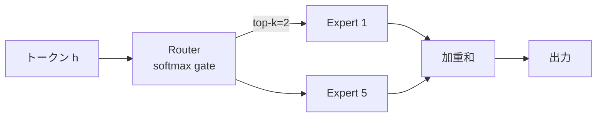

# 第3章 Mixture of Experts (MoE)

DeepSeek-V3 が **671B パラメータなのに推論時 37B しか活性化されない** という仕組みは、
**Mixture of Experts (MoE)** という構造によって実現されています。
本章では MoE のしくみと、DeepSeek 独自の工夫を学びます。

> **この章の立ち位置**
> 第2章で確認した Transformer ブロックの **FFN 部分を「複数のエキスパートから選ぶ」形に差し替える** のが MoE です。
> Attention・残差接続・RMSNorm はそのまま。変わるのは「1 つの FFN」だった部分だけ、という点を意識しながら読み進めてください。
> 以降の章で扱う RoPE（第4章）や MLA（第5章）は Attention 側の改良なので、
> 本章の MoE とは **独立に併用できる** 拡張になります。

## 3.1 なぜ MoE なのか

### dense モデルのスケーリング則と限界

Transformer の性能は、経験則として **パラメータ数・データ量・計算量の 3 つを同じ比率で増やしていくと、
ロスが滑らかに下がっていく**（Chinchilla 則などのスケーリング則）ことが知られています。
そのため LLM 開発は長らく「とにかくパラメータを増やす」方向で進んできました。

しかし dense な Transformer では、全トークンの計算に全パラメータが使われます。
つまり **モデルを大きくすると計算量も比例して増える**。
1 兆パラメータのモデルは、100 億パラメータのモデルの 100 倍の計算コストを必要とします。
これは学習コストはもちろん、**推論時の 1 トークンあたりのコスト** も同じ比率で増えることを意味し、
サービス提供の観点では致命的です。

### MoE の発想：条件付き計算

一方で MoE は

> 「**1トークンが通るのは一部のパラメータ** だけ」

という **条件付き計算（conditional computation）** を導入します。
これにより「パラメータは巨大・計算は軽い」モデルが作れます。

直感的には、人間の脳にたとえると分かりやすいかもしれません。
数学の問題を解くときは数理的な推論を担う領域が、文章を書くときは言語野が、
というように **タスクに応じて脳の一部だけが活発に使われる** のと似た構造を、
ニューラルネットに持ち込んだものが MoE です。

実際の DeepSeek-V3 では、総パラメータ 671B のうち **1 トークンあたり 37B（約 5.5%）だけが活性化** されます。
- 学習・推論の計算量は 37B dense モデル相当
- 表現力・知識量は 671B モデル相当

という、**「計算コストと表現力を切り離す」** のが MoE の本質です。

### 他の効率化手法との違い

LLM の推論コストを下げる手法は MoE 以外にもいくつかあります。混同しやすいので整理しておきます。

| 手法 | 何を減らすか | パラメータ数への影響 |
|---|---|---|
| **量子化（quantization）** | 1 パラメータあたりのビット数 | 変わらない（表現精度のみ下がる） |
| **プルーニング（pruning）** | 不要な重みを 0 にする | 実効的に減る |
| **蒸留（distillation）** | モデル全体を小さくする | 減る |
| **MoE** | **1 トークンあたり使うパラメータ数** | **総数は増え、実効数は減る** |

MoE は「総量を増やしつつ、都度使う量を減らす」という点で他と性格が違います。
量子化やプルーニングとも **併用可能** です（実際 DeepSeek-V3 も重みは FP8 で保持されます）。

## 3.2 FFN を複数用意する

### 構造：FFN を $N$ 個に複製し、ルーターで選ぶ

第2章の FFN 層を思い出してください。
dense な Transformer では、各ブロックの FFN は「1 つの大きな 2 層 MLP（SwiGLU）」でした。
MoE はこの FFN を **$N$ 個のコピー（エキスパート）** として複製し、
各トークンごとに **どのエキスパートを使うか** を **ルーター（router）** と呼ばれる小さな線形層が決めます。



重要なのは、**選択がトークンごとに行われる** という点です。
同じ文中であっても、「the」というトークンと「微分方程式」というトークンでは、
通るエキスパートがまったく違う可能性があります。
層ごと・トークンごとに異なる経路をたどるので、
1 つの入力文が最終出力に至るまでには **トークン数 × 層数** 個の独立なルーティング判断が発生します。

### 数式で見る — エキスパートの加重和

数式で書くと、エキスパート $\{E_i\}_{i=1}^N$ とゲート $g_i(x)$ に対して

$$
y = \sum_{i \in \mathrm{TopK}(g(x))} g_i(x) \cdot E_i(x)
$$

式の意味を順に追うと:

1. **$g(x) = \mathrm{softmax}(x W_g)$**: ルーターはトークンベクトル $x$ を受け取り、
   $N$ 個のエキスパートそれぞれへの「適合度スコア」を softmax で確率分布に変換します。
   この $W_g \in \mathbb{R}^{d \times N}$ がルーター本体で、学習可能なパラメータは案外少ない（$d \times N$ 個だけ）。
2. **$\mathrm{TopK}(g(x))$**: $N$ 個の中で適合度スコアが上位 $k$ 個のエキスパートだけを選びます。
   残りの $N-k$ 個は完全に計算しません（ここで計算コストが落ちる）。
3. **$\sum g_i(x) \cdot E_i(x)$**: 選ばれたエキスパートの出力に、対応するゲート値を重みとして掛けて和を取ります。
   実装上は top-k の中で softmax を正規化し直して重みの合計を 1 にすることが多いです。

- ゲート $g_i(x) = \mathrm{softmax}(x W_g)_i$
- $\mathrm{TopK}$ は上位 $k$ 個のエキスパートだけを選ぶ
- DeepSeek-V3 では **$N=256$ ルーテッドエキスパート + 1 共有エキスパート**, **top-k=8** を採用

### top-k の選び方が難しい理由

top-k は MoE 設計の中でも悩ましいハイパーパラメータです。トレードオフを整理すると:

- **$k$ を小さく**: 1 トークンあたりの計算量が減る。ただしルーターの判断が少し外れただけで大きく出力が変わるため、
  学習が不安定になりやすい。勾配が選ばれた $k$ 個にしか流れず、残りのエキスパートは学習が遅れる。
- **$k$ を大きく**: 複数エキスパートの加重和で滑らかになり学習は安定するが、計算量が増え MoE の利点が薄れる。

Mixtral-8x7B は $N=8, k=2$、DeepSeek-V3 は $N=256, k=8$。
絶対数は違いますが、**「エキスパート総数の約 25%〜3% を使う」** という比率で見るとそれぞれ合理的な設計になっています。

> ⚠️ **Warning**  top-k を小さくすると計算は軽くなりますが、
> ルーティングが不安定になり学習が壊れやすくなります。

### なぜ微分不可能な操作なのに学習できるのか

初学者がつまずきやすいのが「TopK は離散的で微分できないはずなのに、どうやって逆伝播するのか？」という点です。
実装上は次の工夫で解決されています。

- **選ばれたエキスパートの重み $g_i(x)$ だけは微分可能**。
  ゲート値の softmax を通った連続値なので、通常通り勾配が流れる。
- **選ばれなかったエキスパート** には勾配が流れない（TopK で切り捨てられるため）。
- **ルーター $W_g$ 自身** は、選ばれたエキスパートの出力を通じて間接的に学習される。

この「TopK の境界は勾配を通さないが、選ばれたものの重みは通す」という緩い学習で十分機能する、
というのが経験的に確認されている MoE の不思議な性質です。

## 3.3 DeepSeek の 3 つの工夫

MoE 自体は 1991 年の Jacobs らの研究に遡る古い発想で、
近年の LLM 応用としては Google の Switch Transformer（2021）や GShard、Mixtral-8x7B（2023）が有名です。
DeepSeek-V3 はこの系譜に 3 つの独自改良を加え、「細かく、共有し、補助損失に頼らない」設計を徹底しました。
順に見ていきます。

### 3.3.1 Shared Expert（共有エキスパート）

すべてのトークンが必ず通る **共通エキスパート** を 1 つ加えます。
これにより、「全トークンに共通する基礎的特徴量」を専用に学習できるようにして、
ルーテッドエキスパートが *尖った* 役割に集中できるようにします。

**なぜこれが効くのか**:
ルーテッドエキスパート（Top-K で選ばれる側）のみに頼ると、
どのエキスパートにも「どんなトークンにも必要な汎用処理」を少しずつ学習させる必要があり、
結果としてエキスパート同士が似てしまって専門分化が進みにくくなります。
共有エキスパートが「みんなが使う土台」を引き受けてくれることで、
ルーテッドエキスパートは **「他と違う独自の役割」** に学習容量を集中できる、という分業が成立します。

実装上は、共有エキスパート出力とルーテッドエキスパートの加重和を合算して次の層に渡すだけの単純な構造です。
後述の擬似コードの `self.shared(h)` の行がこれに対応します。

### 3.3.2 Fine-grained Experts（細粒度エキスパート）

従来の Mixtral-8x7B は「大きなエキスパート 8 個」の構成でしたが、
DeepSeek-V3 は **エキスパートを小さく切って256個** に増やしています。
「細粒度の専門家を多数」から組み合わせる方が、
同じ計算量でも表現力が上がるという設計判断です。

**数値で見る対比**:

| モデル | エキスパート数 $N$ | top-k | 活性エキスパート数 / $N$ |
|---|---|---|---|
| Mixtral-8x7B | 8 | 2 | 25% |
| DeepSeek-V3 | 256（+1 共有） | 8 | 3% |

一度に使われるエキスパート数（top-k）は増えていますが、各エキスパート自体はずっと小さく、
**「どの 8 個の組み合わせを選ぶか」の選択肢が $\binom{256}{8} \approx 4 \times 10^{14}$ 通り** に膨らみます。
これは Mixtral の $\binom{8}{2}=28$ 通りと比べて桁違いで、
**「専門家の組み合わせによる表現の多様性」** が大幅に広がります。
論文ではこれを **combinatorial flexibility（組み合わせ柔軟性）** と呼んでいます。

### 3.3.3 Auxiliary-loss-free ロードバランシング

**ロードバランシング問題とは何か**:
MoE を素朴に学習させると、**一部の人気エキスパートにトークンが集中する** という現象が起きます。
一度多くのトークンが流れ込んだエキスパートは、その分学習が進み、
さらに多くのトークンを引き寄せ……という正のフィードバックで、
**大半のエキスパートが使われないまま遊んでしまう** のです。これを routing collapse（ルーティング崩壊）と呼びます。

全トークンが同じエキスパートに集中すると、残りの専門家は遊んでしまいます。
これを防ぐためにルーターの分布を平坦化する **補助損失**（aux loss）が従来は必要でした。
典型的には、ルーターの出力分布に「各エキスパートが均等に使われるよう」ペナルティをかけるもので、
Switch Transformer 以来広く使われてきました。

しかし補助損失には副作用があります。
**本来のタスク損失（次トークン予測のクロスエントロピー）に別の目的を足し込むため、
モデルの性能がわずかに犠牲になる** のです。
強い aux loss は確かにロードを均すが、肝心の言語モデリング精度が下がる。弱めると崩壊する。このバランス調整は苦痛でした。

DeepSeek-V3 はこれを避け、**専門家ごとにバイアスを動的調整する** ことで
*学習目的を汚さずに* ロードバランシングします。

```python
# 擬似コード
bias[i] -= step * (load[i] - target)   # 使われすぎた専門家は負にバイアス
```

**仕組みの直感**:
- ルーターの softmax 前スコア $g(x)$ に、エキスパートごとの補正バイアス $b_i$ を加えておく。
- 直近で使われすぎたエキスパート（`load[i] > target`）の $b_i$ をじわじわ減らす。
- 使われなさすぎたエキスパートの $b_i$ は逆に増やす。
- この操作は **損失関数には一切触らず**、ルーターの「入口のスコア」だけをフィードバック制御で動かすだけ。

結果として、タスク損失を汚さずに均等なロードが自然に達成されます。
エアコンのサーモスタットのように、「温度（負荷）を見て吹き出しを調整する」制御ループに近い発想です。

## 3.4 MoE ブロックの擬似実装

前章の `Block` の FFN 部分だけ差し替えると MoE ブロックになります。
**Attention・残差接続・RMSNorm はそのまま残る** ことに注目してください。
差分は `self.ffn(...)` が `self.shared(h) + 加重和(選ばれたエキスパート)` に変わるだけです。

```python
class MoEBlock(nn.Module):
    def __init__(self, d, d_ff, n_experts, top_k):
        super().__init__()
        self.norm1 = RMSNorm(d); self.attn = MHA(d)
        self.norm2 = RMSNorm(d)
        self.router = nn.Linear(d, n_experts, bias=False)
        self.experts = nn.ModuleList([SwiGLU(d, d_ff) for _ in range(n_experts)])
        self.shared  = SwiGLU(d, d_ff)   # shared expert
        self.top_k = top_k

    def forward(self, x):
        x = x + self.attn(self.norm1(x))
        h = self.norm2(x)
        # ルーティング
        logits = self.router(h)            # (B, T, N)
        topv, topi = logits.topk(self.top_k, dim=-1)
        topw = topv.softmax(dim=-1)
        # 各トークンを top-k エキスパートに送る
        out = self.shared(h)
        for k in range(self.top_k):
            out = out + self._dispatch(h, topi[..., k], topw[..., k])
        return x + out
```

### コードを読み解く

- `self.router = nn.Linear(d, n_experts, bias=False)`:
  ルーターは **小さな線形層 1 枚** です。入力 $d$ 次元 → エキスパート数 $N$ 次元のスコアに変換するだけ。
  パラメータ数は $d \times N$ 個で、エキスパート本体に比べれば微々たるものです。
- `logits.topk(self.top_k, dim=-1)`:
  各トークンについて、最もスコアが高いエキスパート $k$ 個を選ぶ操作。
  `topv` がスコア、`topi` がエキスパート番号（0 〜 N-1 の整数）。
- `topw = topv.softmax(dim=-1)`:
  選ばれた $k$ 個のスコアだけで softmax を取り直し、**合計 1 の重み** にする。
  全エキスパートで softmax すると大半が 0 近くになってしまうので、選ばれた中で正規化するのが実装の定石です。
- `out = self.shared(h)`:
  3.3.1 で説明した共有エキスパート。全トークンが必ず通る基礎特徴量の計算。
- `for k in range(self.top_k): ...`:
  トークンごとに異なるエキスパートを通すため、ループの中で top-k 個を順に適用。
  実際の高速実装では **トークンをエキスパートごとにまとめて batch 化** し、
  GPU 上で並列実行します（このまとめ処理が `_dispatch` 相当）。
- `return x + out`:
  最後に Attention 後の残差 `x` に FFN 出力 `out` を足して、**第2章と同じ残差接続** で次の層に渡します。

### 分散学習特有の難しさ：All-to-All 通信

dense モデルと MoE で決定的に違うのは、**エキスパートを複数 GPU に分散して持つ必要がある** という点です。
256 個のエキスパートを 1 GPU に載せるのはメモリ的に不可能なので、
たとえば「GPU 0 はエキスパート 0〜31、GPU 1 は 32〜63 ...」と分割します（**Expert Parallelism**）。
そしてトークンごとに「行き先のエキスパート」が違うため、次のような通信が発生します。

1. 各 GPU で入力トークンを処理する
2. ルーターがトークンの行き先（どの GPU のどのエキスパート）を決める
3. **トークンを行き先 GPU へ送る**（All-to-All 通信）
4. 各 GPU が自分の担当エキスパートで計算
5. **計算結果を元の GPU に戻す**（もう一度 All-to-All 通信）

この All-to-All は全 GPU が互いにデータを送り合う操作で、
ネットワーク帯域を大量に使います。
MoE が「理論上は軽い」のに「実用上は遅い」と言われる最大の原因がこの通信コストで、
DeepSeek が MoE 効率化のために独自通信ライブラリ（deepseek-ai/EP, DualPipe など）を開発している理由でもあります。

`_dispatch` の実装は **All-to-All 通信** を使って分散GPU間でトークンをシャッフルする部分で、
本番実装では `deepseek-ai/EP` や `huggingface/transformers` の最適化版が使われます。

> 💡 **Tip**  MoE の本当の強みは **学習時の FLOPs** も削減されること。
> 同じ計算資源で dense より大きなモデルが学習できます。
> ただし上記の通信コストのため、「FLOPs は減るが壁時計時間は必ずしも減らない」点には注意が必要です。

## 3.5 MoE と推論モデル

R1 のような推論モデルは、**長い CoT を生成** するため、
1 サンプルで数千〜数万トークン分の計算が必要になります。
通常のチャット応答が数百トークンで収まることと比べると、**1 桁から 2 桁長い** 生成になります。
この長さは単にコストの問題だけではなく、**MoE にとって追い風になる特性** を持っています。

### なぜ推論モデルと MoE は相性が良いのか

MoE なら、その長い推論の中で **トークンごとに違う専門家** を使えるので、
「数式を解く専門家」「論理推論の専門家」「自己反省の専門家」といった
**役割分担** が暗黙に学習されると期待されます。
実際、DeepSeek の Technical Report にもこの観察が記述されています。

より具体的に、推論モデル固有の 3 つの相性の良さを整理すると:

1. **推論の中で状況が変わる**
   CoT は「問題を読む → 式を立てる → 計算する → 結果を確認する → 答える」のような複数フェーズを含みます。
   各フェーズで必要とされる処理が違うので、トークンごとに別エキスパートを使う MoE の性質が活きます。
   dense モデルはどのフェーズでも同じパラメータを総動員するため、特化の余地がありません。
2. **長い系列にわたってロードが自然に均される**
   MoE のロードバランシングは「トークン数が多いほど均等に均されやすい」性質があります。
   推論モデルの長い CoT 生成は、短い応答より **ルーティングの偏りが統計的に解消されやすい**。
3. **計算コストを総パラメータから切り離せる**
   CoT が長いほど推論コストは線形に増えます。
   dense で同等の知識量を持たせようとすると 1 トークンあたりのコストも重くなりますが、
   MoE なら「知識量は維持しつつ、1 トークンあたりの計算は軽い」状態を保てるので、
   長い CoT を現実的なコストで生成できます。

このため、「大量の知識を参照しつつ、長く考える」モデルを作りたい場合、
MoE は dense よりもアーキテクチャ上のメリットが大きく、
DeepSeek-V3/R1 が MoE を採用した戦略的理由の 1 つになっています。

## 3.6 まとめ：dense vs MoE

改めて dense と MoE の違いを表で整理します。

| 観点 | dense | MoE |
|---|---|---|
| 総パラメータ | 小 | 大 |
| 1トークン当たりFLOPs | 多 | 少 |
| メモリ消費（推論） | 総パラ分 | 総パラ分（読み込みは全量） |
| 学習安定性 | 高 | やや低（ルーティング崩壊リスク） |
| 専門性の分化 | 暗黙 | 明示 |
| 通信コスト（分散学習時） | 低（主にデータ並列） | **高**（All-to-All が必須） |
| 推論時の最適化難易度 | 標準的 | 高（バッチサイズや KV キャッシュの扱いが複雑） |

### 実務的な注意点

この表から読み取ってほしい実務的なポイントをいくつか挙げておきます。

- **「メモリは総パラメータ分必要」**
  「1 トークンあたりの計算は 37B で済む」のは計算量（FLOPs）の話であって、
  **モデル全体を GPU メモリに載せる必要がある** 点は dense と変わりません。
  DeepSeek-V3 を動かすには 671B 分のパラメータ（FP8 で約 700GB）を保持できるメモリが必要です。
  個人の GPU 1 枚で動かせないのはこのためです。
- **「学習の壁時計時間はそれほど速くならない」**
  FLOPs は減っても All-to-All の通信がボトルネックになり、
  壁時計時間（wall-clock time）は dense とほぼ同等か、場合によっては遅くなることもあります。
  MoE の真価は「同じ計算予算でより知識量の多いモデルが作れる」点にあり、
  「既存の dense より速くなる」ではない、という点は注意が必要です。
- **「推論サービング側の実装が重い」**
  MoE は推論時にもトークンごとに異なるエキスパートを呼ぶため、
  通常の Transformer 推論エンジンでは効率的に動きません。
  vLLM・TensorRT-LLM・SGLang などの近年の推論エンジンは MoE 対応を進めていますが、
  **「MoE をサポートしているか」はモデル選定時の重要な確認事項** です。

### 本書の他章との位置づけ

Open-R1 で実験に使われる **Qwen2.5 / Llama-3** は dense モデルなので、
MoE を動かすハードルが下がるまでは「dense で学習・MoE は読むだけ」で構いません。
実際、本書の後半で扱う SFT・GRPO・報酬関数といった学習レシピは、
**dense でも MoE でもそのまま適用できる** 一般的な手法です。
つまり「DeepSeek-R1 の学習レシピ」を再現するにあたって、
MoE を理解することは必須ではありますが、自分で MoE モデルを学習する必要は必ずしもありません。

## 🧪 手を動かしてみよう

1. `n_experts=4, top_k=1` の Toy MoE を実装し、
   ランダム入力 1000 件をルーティングさせて、各エキスパートに割り振られたトークン数を集計してください。
   最頻のエキスパートに極端に偏っていないか観察しましょう。

2. 上記に **Load-balancing loss**（ゲート平均と割り当て平均の積の総和）を追加して、
   偏りがどれだけ緩和されるか比較してください。解答: [`examples/ch03/moe_toy.py`](../examples/ch03/moe_toy.py)

3. `Mixtral-8x7B` と DeepSeek-V3 のアーキテクチャ差を、**「エキスパート粒度」「top-k」「共有エキスパートの有無」** の観点で1段落にまとめてみましょう。

---

[← 第2章 Transformer](ch02.md) ｜ [→ 第4章 位置表現とRoPE](ch04.md)
