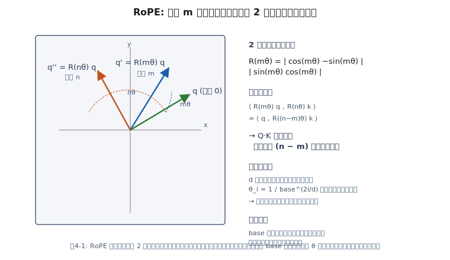

# 第4章 位置表現と RoPE

Attention は **Q, K, V の値** だけを見ているので、
入力を並び替えても結果が変わらない **順序不変** の演算です。
そこに「何番目のトークンか」を教える仕組みが **位置エンコーディング (Positional Encoding)** です。
DeepSeek-V3 を含む現代の主要 LLM は、ほぼすべて **Rotary Positional Embeddings (RoPE)** を採用しています。

## 4.1 位置情報なしでは何が起きる？

以下の 2 文を考えてみます。

1. 「犬が猫を追う」
2. 「猫が犬を追う」

トークン集合は同じで、意味は逆です。
位置情報が無ければ、Transformer はこの2つを区別できません。

## 4.2 絶対位置エンコーディングとその限界

オリジナル Transformer (2017) は sin/cos を使った **加法的な絶対位置** を
埋め込みに足し込んでいました。

$$
\mathrm{PE}_{\text{pos},2i} = \sin(\text{pos} / 10000^{2i/d}),\quad
\mathrm{PE}_{\text{pos},2i+1} = \cos(\cdots)
$$

問題点:

- 学習時に見たことのない長さ（例: 8K で学習→32Kで推論）に **外挿しにくい**
- Attention 計算は Q と K の **相対位置** に依存しているはずなのに、
  絶対位置しか入れていないのは不自然

## 4.3 RoPE の中心アイデア

RoPE は次のように考えます。

> 「Q と K のベクトルを、位置 $m$ に応じて **複素平面で回転** させてから内積を取れば、
> 結果は自然に **相対位置 $(m - n)$ の関数** になる」

$d_k$ 次元のベクトルを 2 次元ペアに分割し、各ペアを角度 $m\theta_i$ だけ回転します。
$i$ 番目のペアについて

$$
R_{m,i} = \begin{pmatrix} \cos m\theta_i & -\sin m\theta_i \\ \sin m\theta_i & \cos m\theta_i \end{pmatrix},\quad
\theta_i = 10000^{-2i/d_k}
$$

こうして回転させた Q, K を内積すると、**$(m-n)\theta_i$ だけに依存** することが
三角関数の公式から導けます。

$$
\langle R_m q, R_n k \rangle = \langle q, R_{n-m} k \rangle
$$

つまり Attention スコアが **相対位置の関数** になる、というのが RoPE の核心です。



> 図4-1 の左側で 3 本の矢印（位置 0, m, n）が同じ q から異なる方向を向いているのが見えます。
> 内積を取ると **角度差** $(n - m)\theta$ のみが残る — これが「相対位置だけが効く」と書いた式の幾何的な意味です。

## 4.4 実装

PyTorch で書くと驚くほど短く書けます。

```python
def rope_cache(seq_len, d, base=10000.0, device='cpu'):
    # theta_i = base^{-2i/d}
    i = torch.arange(0, d, 2, device=device).float()
    theta = 1.0 / (base ** (i / d))
    m = torch.arange(seq_len, device=device).float()
    freqs = torch.outer(m, theta)        # (T, d/2)
    return freqs.cos(), freqs.sin()      # それぞれ (T, d/2)

def apply_rope(x, cos, sin):
    # x: (..., T, d)
    x1, x2 = x[..., ::2], x[..., 1::2]
    rx1 = x1 * cos - x2 * sin
    rx2 = x1 * sin + x2 * cos
    return torch.stack((rx1, rx2), dim=-1).flatten(-2)
```

Attention の中では **Q と K にだけ** RoPE を適用します。V にはかけません。

```python
cos, sin = rope_cache(T, d_k, device=q.device)
q = apply_rope(q, cos, sin)
k = apply_rope(k, cos, sin)
```

## 4.5 長文対応：NTK-aware と YaRN

RoPE は相対位置を三角関数で埋め込むため、**学習時より長い系列** にある程度外挿できます。
しかしそのまま倍の長さを与えると、高周波成分が振動してしまい精度が落ちます。
これを改善するのが **RoPE scaling** の各種手法です。

| 手法 | 要旨 |
|---|---|
| **Position Interpolation (PI)** | 位置を係数 $s<1$ で縮めて無理やり学習範囲に収める |
| **NTK-aware** | 低周波はそのまま、高周波だけ圧縮して外挿性を改善 |
| **YaRN** | NTK+注意温度補正。32K→128K 等の大幅拡張で最も一般的 |

DeepSeek-V3 / R1 は **128K コンテキスト** を実現するために YaRN を活用しています。
Open-R1 の学習設定でも、最大シーケンス長は **32,768** と長めに設定されています。

## 4.6 DeepSeek の Multi-head Latent Attention (MLA) と RoPE

DeepSeek は通常の MHA ではなく **MLA (Multi-head Latent Attention)** を使います。
MLA は Q/K/V を一度 **低ランク潜在空間** に圧縮してから展開することで、
KV キャッシュをわずか数KB / 1トークンにまで圧縮します。

RoPE との組み合わせが難しいポイントは:

- 潜在 K にそのまま RoPE をかけると、展開行列と可換でなくなり崩れる
- → DeepSeek は K を **「潜在部分」と「RoPE専用部分」** の 2 部構成にする
  - 潜在部分は展開行列を通してから使う
  - RoPE 部分は最初から RoPE 変換を適用しておく

実装の詳細は本書のスコープ外ですが、
「なぜ DeepSeek の K だけ少し変な形をしているのか」の理由を知っておくとコードが読めます。

## 4.7 まとめ

- 位置情報を与えないと Attention は順序不変
- RoPE は **Q, K を位置に応じて複素回転** させ、スコアを相対位置の関数にする
- 外挿には YaRN などの scaling が効く
- DeepSeek は MLA と組み合わせて KV キャッシュを極端に小さくする

ここまでで、LLM を動かすための **アーキテクチャ側の知識** は一区切りです。
次章からは **どうやって学習するか** に話を移します。

## 🧪 手を動かしてみよう

1. `d_k=8, seq_len=16` の RoPE を実装し、同一ベクトル $q=k$ を位置 0 と位置 8 に置いたときの Attention スコア行列を可視化してください。対角線から離れるほどスコアが下がる様子を観察しましょう。
   [`examples/ch04/rope_demo.py`](../examples/ch04/rope_demo.py) に参考実装があります。

2. 上記のスクリプトで、**RoPE を掛けない** Q, K でも同じ可視化をし、
   対角近傍の構造が失われることを確認してください。

3. `transformers` の `LlamaAttention` の実装を読み、
   本章の擬似コードとどう対応しているか対応関係を書き出してみましょう。

---

[← 第3章 MoE](ch03.md) ｜ [→ 第5章 事前学習とSFT](ch05.md)
