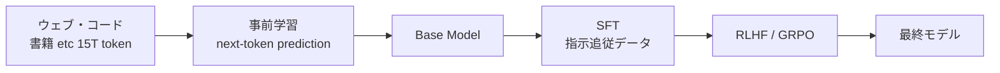

# 第5章 事前学習と教師あり微調整（SFT）

ここからは LLM の **学習フェーズ** に入ります。
本章では、LLM の一生のうちでも最もお金のかかる 2 フェーズ

1. **Pre-training（事前学習）**: 次トークン予測を大規模コーパスで
2. **Supervised Fine-Tuning (SFT)**: 人間が作った良質な対話データで方向づけ

を、損失関数と具体的なコード例を通じて確認します。

## 5.1 LLM の一生



本書が扱う推論モデル（R1 系）は、上の流れをさらに複雑にしたものですが、
根っこにはこの **PT → SFT → RL** の構図があります。

## 5.2 事前学習：次トークン予測

LLM の事前学習は、すべて **次トークン予測（Causal LM）** という
一つの単純なタスクに還元されます。

入力 $x_1 x_2 \dots x_T$ に対し、各位置 $t$ で

$$
\mathcal{L} = -\sum_{t=1}^{T} \log p_\theta(x_t \mid x_{<t})
$$

を最小化する。ただそれだけ。

- データ: ウェブ・書籍・コード・学術論文など数十兆トークン
- DeepSeek-V3 は **14.8T トークン** で事前学習（2024年公開）

この事前学習を終えた時点のモデルを **Base Model** と呼び、
R1 系の出発点となる `DeepSeek-V3-Base` もこの段階のモデルです。

### コード: ミニ事前学習

```python
from transformers import AutoModelForCausalLM, AutoTokenizer
import torch

tok = AutoTokenizer.from_pretrained("Qwen/Qwen2.5-0.5B")
model = AutoModelForCausalLM.from_pretrained("Qwen/Qwen2.5-0.5B").cuda()

text = "素数とは1と自身以外に約数を持たない自然数である。"
ids = tok(text, return_tensors="pt").input_ids.cuda()

# 目的語はずらした入力
labels = ids.clone()
out = model(ids, labels=labels)
print(out.loss.item())  # これが -log p(x_{1:T}) の平均
```

`labels` を渡すと transformers が内部で shift して CE loss を計算してくれます。

## 5.3 なぜそのままではダメなのか

事前学習済みの Base Model は膨大な知識を持っていますが、次のような癖があります。

- 「質問に答える」より「続きを書く」挙動をする（例: 質問をそのまま延々と複製する）
- 危険・不適切な出力を平然と生成する
- ユーザーの意図（指示）に従うという概念がない

そこで、**指示追従・望ましい応答** を教え込む段階が必要になります。

## 5.4 SFT (Supervised Fine-Tuning)

### 5.4.1 データ形式

SFT では `(instruction, response)` のペアを大量に用意し、
**response の部分だけの CE loss** を最小化します。

```json
{
  "instruction": "素数を小さい順に3つ挙げよ。",
  "response": "2, 3, 5"
}
```

推論モデルの SFT はさらに **推論プロセス (CoT) を含む** のが特徴です。
例えば OpenR1-Math-220k の 1 件は次のような形をしています（概念）。

```
<|user|>  問題: xの方程式 2x+3=11 を解け。
<|assistant|><think>
移項して 2x = 11 - 3 = 8。両辺を2で割ると x = 4。
</think>
よって x = 4。
```

### 5.4.2 損失：`response` だけ数える

```python
def compute_loss(model, tok, example):
    full = example["instruction"] + example["response"]
    ids  = tok(full, return_tensors="pt").input_ids.cuda()
    # instruction 部分のラベルを -100 にしてマスク
    inst_len = len(tok(example["instruction"]).input_ids)
    labels = ids.clone()
    labels[:, :inst_len] = -100   # -100 は CE loss で無視
    return model(ids, labels=labels).loss
```

`-100` で埋めることで、**応答側だけを真似する** モデルに仕上がります。

## 5.5 Chat Template

モデルごとに決まった **チャットテンプレート** があり、
この形に従って `user` と `assistant` を書く必要があります。

```python
>>> tok.apply_chat_template(
...     [{"role": "user", "content": "素数を3つ挙げよ"}],
...     tokenize=False, add_generation_prompt=True
... )
'<|im_start|>user\n素数を3つ挙げよ<|im_end|>\n<|im_start|>assistant\n'
```

Open-R1 のスクリプトもこのテンプレート適用を内部で行っています。

## 5.6 Open-R1 の SFT スクリプト

`src/open_r1/sft.py` は `trl` の `SFTTrainer` をほぼそのまま使ったシンプルな構成です。
キーとなる設定は以下:

```yaml
# recipes/OpenR1-Distill-7B/sft/config.yaml (抜粋)
model_name_or_path: Qwen/Qwen2.5-7B
dataset_name: open-r1/Mixture-of-Thoughts
learning_rate: 4.0e-5
max_seq_length: 32768
per_device_train_batch_size: 2
gradient_accumulation_steps: 8
bf16: true
gradient_checkpointing: true
num_train_epochs: 3
```

ポイント:

- **`max_seq_length: 32768`**: 長い CoT を切り詰めず学習できるように
- **`bf16`**: H100 では必須。FP16 より数値的に安定
- **`gradient_checkpointing`**: 活性をキャッシュせず再計算しメモリを削減

## 5.7 SFT でよく詰まるポイント

| 症状 | よくある原因 | 対処 |
|---|---|---|
| ロスが下がらない | チャットテンプレート不一致 | `tokenizer.chat_template` を確認 |
| 推論時に `<think>` が閉じない | `eos_token_id` 未設定 | generate 時に渡す |
| メモリ OOM | `max_seq_length` が長すぎ | gradient_checkpointing + DeepSpeed ZeRO-3 |
| 出力が繰り返す | 学習データに繰り返し多数 | データ重複除去 |

## 5.8 まとめ

- 事前学習 = 次トークン予測を大規模に
- SFT = 指示＋応答のペアで CE loss、応答側だけを数える
- 推論モデルの SFT データは **`<think>` タグ付き CoT** を含む
- Open-R1 は `trl` の SFTTrainer 上に薄く実装されている

次章では、SFT の先にある **強化学習（RL）** の基本を学びます。
PPO・方策勾配・価値関数といった用語を、数式と直感の両面から整理します。

## 🧪 手を動かしてみよう

1. `Qwen2.5-0.5B` を `trl` の `SFTTrainer` で、
   自作の 10 件程度の `(instruction, response)` データで 1 epoch 学習させてみてください。
   学習前後で出力がどれだけ指示追従的になるか比較しましょう。
   参考: [`examples/ch05/minisft.py`](../examples/ch05/minisft.py)

2. 上記のデータに `<think>...</think>` タグ付き CoT を混ぜた版で学習し、
   生成時に **思考過程が自発的に出てくるか** を観察してください。

3. `open-r1` リポジトリの `src/open_r1/sft.py` と `recipes/OpenR1-Distill-7B/sft/config.yaml` を読み、
   **本章で挙げたハイパーパラメータが実際どこに現れるか** マッピングしてみましょう。

---

[← 第4章 RoPE](ch04.md) ｜ [→ 第6章 強化学習入門](ch06.md)
