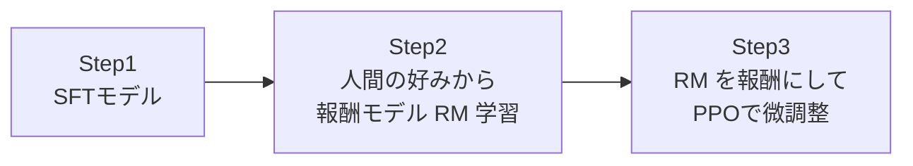
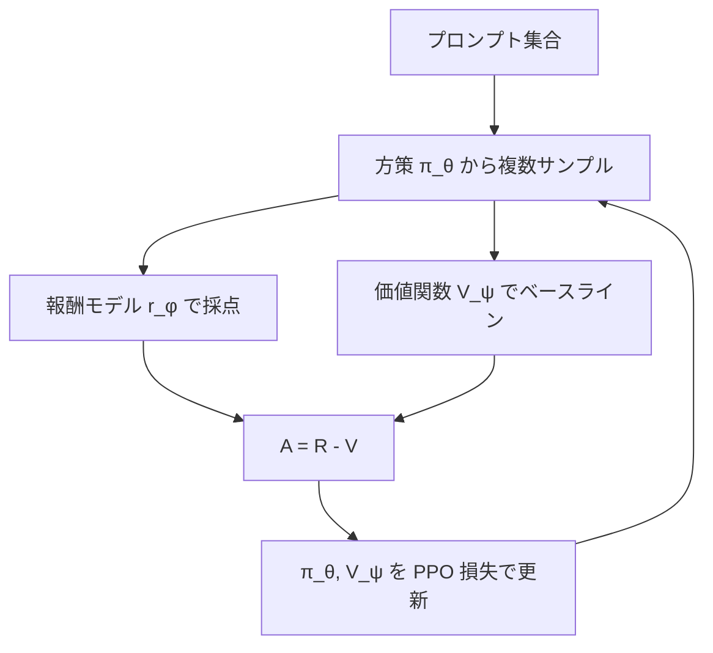

# 第6章 強化学習入門（RLHF / PPO）

SFT だけだと「模範解答を真似する」学習しかできません。
**「複数の答えの中でどれが優れているか」を評価しながら改善する** のが強化学習 (RL) です。
本章では、LLM における RL の代表格 **RLHF + PPO** を最短距離で理解します。
次章の **GRPO** は、この PPO の一改造として自然に理解できます。

## 6.1 LLM を「方策」と見る

強化学習の用語で LLM を見直すと、

- **状態 $s$** = これまでに生成されたトークン列（プロンプト＋途中まで生成）
- **行動 $a$** = 次のトークン
- **方策 $\pi_\theta(a | s)$** = 言語モデルそのもの
- **報酬 $r$** = 生成が終わったときに 1 回だけ（または時々）与える良し悪しのスコア

つまり、LLM はそのまま **方策** として解釈でき、RL でファインチューニングできます。

## 6.2 RLHF の3ステップ

**Reinforcement Learning from Human Feedback (RLHF)** は ChatGPT で有名になった手法です。



1. **Step1 – SFT**: 第5章の方法でベースモデルを作る
2. **Step2 – 報酬モデル (RM)**: 「応答Aと応答Bのどちらが好きか」の比較データから、
   各応答にスカラーを返すニューラルネット $r_\phi(x, y)$ を学習
3. **Step3 – PPO**: SFTモデルをサンプラーとして、RMからの報酬を最大化するよう微調整

### 報酬モデルの損失

ペア $(y_w, y_l)$（$y_w$ が好まれた方）に対し、

$$
\mathcal{L}_{\text{RM}} = -\log \sigma\!\big(r_\phi(x, y_w) - r_\phi(x, y_l)\big)
$$

これは Bradley-Terry モデルから導かれる **対比的クロスエントロピー** です。

## 6.3 方策勾配の基礎

RL で方策を改善する基本式は **Policy Gradient Theorem**:

$$
\nabla_\theta J(\theta) = \mathbb{E}_{(s,a)\sim\pi_\theta}\big[ R(s,a)\,\nabla_\theta \log \pi_\theta(a|s) \big]
$$

直感: **報酬が高い行動の確率を上げ、低い行動の確率を下げる**。

### REINFORCE 分散を抑える：ベースライン

報酬そのままだと分散が大きすぎて学習が安定しないので、
**アドバンテージ** $A = R - b$ を使います（$b$ は状態依存のベースライン）。

$$
\nabla_\theta J \approx \mathbb{E}\big[ A\,\nabla \log \pi_\theta(a|s)\big]
$$

PPO では $b$ は **価値関数 $V_\phi(s)$**（別ネットワーク）で推定します。
ここが GRPO でバッサリ省略されるポイントです（第7章）。

## 6.4 PPO: Proximal Policy Optimization

方策勾配の素朴な実装には **1 ステップで方策が大きく動きすぎる** 問題があります。
PPO はこれを **クリッピング** で防ぐのが特徴です。

各トークン位置 $t$ で重み比

$$
\rho_t = \frac{\pi_\theta(a_t | s_t)}{\pi_{\theta_\text{old}}(a_t | s_t)}
$$

を計算し、PPO の損失は

$$
\mathcal{L}_{\text{PPO}} = -\mathbb{E}\Big[ \min\big( \rho_t A_t,\;\mathrm{clip}(\rho_t, 1-\varepsilon, 1+\varepsilon) A_t \big) \Big]
$$

- $\varepsilon$ は通常 0.1〜0.2
- $\rho$ が 1 から大きく離れるアップデートをブロックする

### PPO の全体像（LLM向け）



必要なネットワーク: **方策（ポリシー）、参照方策 (π_ref)、価値関数、報酬モデル** の **4つ**。
すべてLLMサイズになりがちで、メモリがつらい。
これが GRPO で報酬モデル以外を削る動機になります。

## 6.5 KL 正則化：壊れすぎないように

RLで自由に最適化すると、モデルが「高い報酬をもらえるが不自然な」 出力に収束する
（*reward hacking*）。これを防ぐために **参照方策（通常は SFT モデル）との KL 距離** をペナルティに加えます。

$$
\mathcal{L}_{\text{RLHF}} = \mathcal{L}_{\text{PPO}} + \beta\,\mathrm{KL}\big(\pi_\theta \| \pi_\text{ref}\big)
$$

$\beta$ が小さすぎるとモデルが壊れ、大きすぎると学習が進みません。
通常 0.01〜0.1 のレンジが使われます。

## 6.6 trl ライブラリでの PPO

Hugging Face の `trl` を使うと、これらが数十行で書けます（PPOTrainer は将来廃止予定ですが、構造把握には便利）。

```python
from trl import PPOTrainer, PPOConfig, AutoModelForCausalLMWithValueHead
from transformers import AutoTokenizer

tok = AutoTokenizer.from_pretrained("Qwen/Qwen2.5-0.5B")
model = AutoModelForCausalLMWithValueHead.from_pretrained("Qwen/Qwen2.5-0.5B")
ref   = AutoModelForCausalLMWithValueHead.from_pretrained("Qwen/Qwen2.5-0.5B")

config = PPOConfig(learning_rate=1e-5, batch_size=16, init_kl_coef=0.02)
trainer = PPOTrainer(config, model, ref, tok)

for batch in dataloader:
    queries = [tok(x, return_tensors="pt").input_ids.squeeze(0) for x in batch["prompt"]]
    responses = trainer.generate(queries, max_new_tokens=64)
    rewards = reward_model(batch["prompt"], tok.batch_decode(responses))
    stats = trainer.step(queries, responses, rewards)
```

各ステップで、方策が古すぎないうちに勾配アップデートを打ち、clip で暴れを抑える — これが PPO の典型ループです。

## 6.7 RLHF の課題と GRPO への橋渡し

RLHF (with PPO) には以下の問題があります。

1. **メモリ重い**: 方策・参照・価値関数・報酬モデルの4つをメモリに乗せる
2. **価値関数の学習が不安定**: LLMサイズの価値関数を GAE で安定学習するのは難しい
3. **報酬モデルのバイアス**: 人間の比較データから学んだ RM に特有の *ハック* が発生

DeepSeek が R1 / R1-Zero で採用した **GRPO** は、このうち **(1) と (2) を同時に解決** する工夫でした。

> 🎯 次章のポイント（先取り）
> - 価値関数を **使わない**
> - 代わりに **同じプロンプトから G 個のサンプル** を取り、そのグループ内スコアの正規化でアドバンテージを推定
> - 報酬モデルも **ルールベース** で置き換え可能（第8章）

## 6.8 まとめ

- LLM を方策 $\pi_\theta$ と見れば、REINFORCE / PPO がそのまま適用できる
- RLHF は SFT → RM → PPO の3段階
- PPO はクリッピング + KL 正則化で安定化するが、メモリ消費が大きい
- GRPO はその課題に対するエレガントな回答（次章）

## 🧪 手を動たしてみよう

1. CartPole のような超小規模タスクで、**REINFORCE と PPO の学習曲線** を
   （数十行のPyTorchで）実装し比較してみましょう。方策勾配の分散がクリッピングでどれだけ安定するかを体感できます。
   [`examples/ch06/cartpole_ppo.py`](../examples/ch06/cartpole_ppo.py)

2. $\pi_\theta$ と $\pi_\mathrm{ref}$ の **KL 距離** が 0.02 / 0.2 / 2.0 のときに、
   どれくらい方策が変わるか、簡単なマルコフ確率分布で計算してみてください。

3. `trl` の `PPOTrainer` のソースコードを開き、本章の式のどこに対応するのか、
   `compute_rewards` と `loss` 関数を中心にコメントをつけながら読みましょう。

---

[← 第5章 SFT](ch05.md) ｜ [→ 第7章 GRPO](ch07.md)
