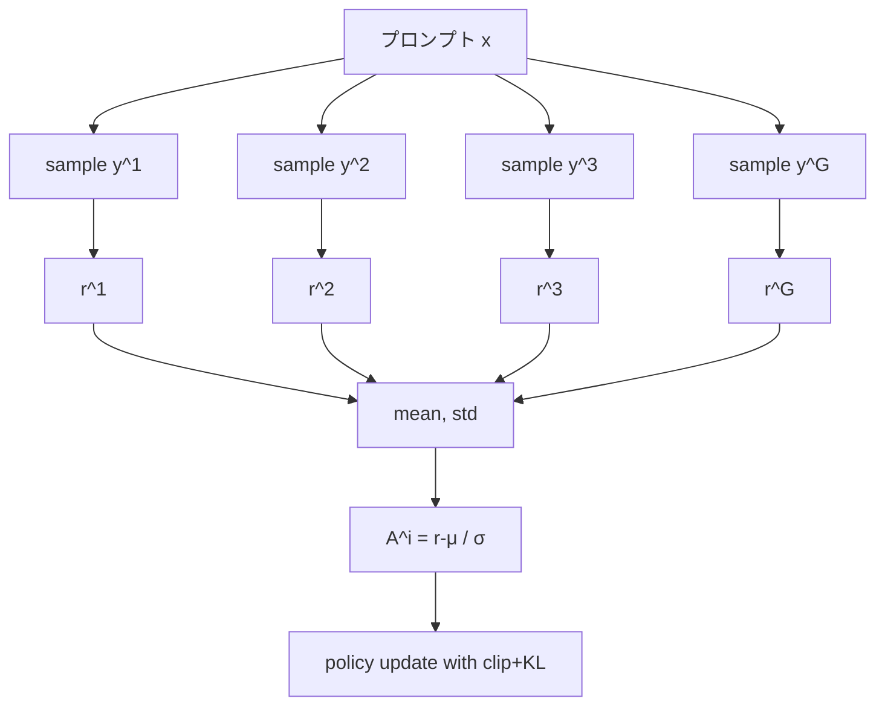

# 第7章 GRPO — Group Relative Policy Optimization

> **この章の立ち位置**
> 本書の中心章です。
> 前章までで見た PPO は汎用的ですが、LLM（特に長い CoT を吐く推論モデル）には
> **価値関数のメモリ・学習不安定性** という弱点があります。
> GRPO は「PPO から価値関数を捨てる」ことでこれを解消し、
> R1-Zero の奇跡を支えた RL アルゴリズムです。
> 本書が PPO ではなく GRPO を重点的に扱う理由は以下の3点。
>
> - **Open-R1 の Step 2 がそのまま GRPO で書かれている**
> - **長い CoT と相性が良く、教育的にも最小構成に近い**
> - **"aha moment"（第8章）の舞台装置**

いよいよ本書の山場です。
DeepSeek が R1 / R1-Zero を訓練するために用いた **GRPO** を、
PPO との差分として理解し、実装レベルで整理します。

## 7.1 GRPO が解こうとした問題

前章で PPO の課題を整理しました。

- 価値関数ネットワークが LLM サイズで、メモリ・計算が重い
- 価値関数の推定誤差が大きく、学習が不安定
- 長い推論系列（何千トークンの CoT）だとさらに悪化

GRPO のアイデアは極端にシンプルです。

> **価値関数は使わず、同じプロンプトに対する $G$ 個のサンプル内での
> 報酬の平均と標準偏差から相対的アドバンテージを作る**

価値関数を丸ごと削除できるので、**メモリ半減** に近い効果があります。

## 7.2 GRPO のアルゴリズム

プロンプト $x$ について、現方策 $\pi_{\theta_\text{old}}$ から $G$ 個の応答をサンプルします。

$$
\{ y^{(1)}, y^{(2)}, \ldots, y^{(G)} \}
$$

### なぜ G 個もサンプルするのか

$G$ 個取る理由は2つあります。

1. **分散低減**: 1サンプルだけだと報酬の「たまたま」の影響が大きい。複数取って平均を基準にすると、アドバンテージ推定の分散が下がる
2. **相対比較**: 絶対スコアではなく「同じプロンプト内で相対的にどれが良かったか」で優劣を決められる。問題難易度のばらつきに頑健

つまり **価値関数 $V$ の代わりを、同一プロンプト内のグループ統計に担わせている** わけです。

### アドバンテージの式

各応答にスカラー報酬 $R^{(i)}$ が付きます（RM、あるいはルールベース。第8章）。
**グループ内の平均と標準偏差** で正規化したアドバンテージを作ります。

$$
A^{(i)} = \frac{R^{(i)} - \mathrm{mean}(R)}{\mathrm{std}(R) + \epsilon}
$$

そして応答 $y^{(i)}$ の **全トークン** に対して、同じ $A^{(i)}$ を使います。
これが「グループ相対」の意味です。

> 💡 **「応答全体に同じ $A^{(i)}$」 の意味**
> 応答 $y^{(i)}$ のどのトークンにも同じ $A^{(i)}$ を掛けるということは、
> **「この応答全体を良かった／悪かったと見なして丸ごと押し上げる／押し下げる」** という操作です。
> ある応答が正解だったら、その中の試行錯誤フレーズも、最終式も、
> **全部まとめて確率が上がる**。これが後章で見る "aha moment" 創発の基礎です。

### 数値で掴む GRPO

同じプロンプトに対して 4 回サンプルし、報酬が

$$
R = [0.0,\ 0.0,\ 0.5,\ 1.0]
$$

だったとします。

- $\mathrm{mean}(R) = 0.375$
- $\mathrm{std}(R) \approx 0.41$
- アドバンテージ:
  $A \approx [(0-0.375)/0.41,\ -0.91,\ (0.5-0.375)/0.41,\ (1-0.375)/0.41] = [-0.91, -0.91, +0.30, +1.52]$

読み取れることは3つ。

1. **同じプロンプトで他のサンプルより良かった応答だけが正のアドバンテージ** を受ける
2. 全員 1.0 だった場合は $\mathrm{std} = 0$ になり、アドバンテージが全て 0 → 学習が進まない
3. 全員 0.0 でも同じ → **グループ内に差が無いと GRPO は何も学べない**

この3. が、後述の **「課題難易度とモデル能力のマッチ」が実験設計の核心** である理由です。

### 目的関数

PPO と同じくクリッピング付きで方策を更新:

$$
\mathcal{L}_{\text{GRPO}}
= -\mathbb{E}\Big[ \min\big( \rho_t^{(i)} A^{(i)},\;\mathrm{clip}(\rho_t^{(i)}, 1-\varepsilon, 1+\varepsilon) A^{(i)} \big) \Big]
+ \beta\,\mathrm{KL}(\pi_\theta \| \pi_\text{ref})
$$

ここで $\rho_t^{(i)} = \pi_\theta(y_t^{(i)} | \cdot) / \pi_{\theta_\text{old}}(y_t^{(i)} | \cdot)$。

図にすると:



## 7.3 PPO との差分表

| 項目 | PPO | GRPO |
|---|---|---|
| 価値関数 $V_\psi$ | **必要**（LLMサイズ） | **不要** |
| アドバンテージ | GAE: $A = r + \gamma V(s') - V(s)$ | グループ内標準化 $(R - \mu)/\sigma$ |
| 同一プロンプトからのサンプル数 | 1 | $G$ 個（通常4〜64） |
| メモリ | 方策+参照+価値+RM（4つ） | 方策+参照+RM（3つ）※ RMはルールベース可 |
| 実装の複雑さ | 価値損失・GAE の実装が必要 | スカラー統計だけで済む |

## 7.4 GRPO 擬似コード

```python
for prompt_batch in dataloader:
    # 1. 各プロンプトに対して G 個サンプル
    samples = []
    for x in prompt_batch:
        ys = policy.generate(x, num_return_sequences=G)
        rs = [reward_fn(x, y) for y in ys]
        samples.append((x, ys, rs))

    # 2. グループ内標準化
    advantages = []
    for x, ys, rs in samples:
        mu, sigma = mean(rs), std(rs) + 1e-8
        advs = [(r - mu) / sigma for r in rs]
        for y, a in zip(ys, advs):
            advantages.append((x, y, a))

    # 3. ミニバッチで GRPO 損失を下げる
    for mb in minibatch(advantages):
        logp_new = policy.log_prob(mb.y | mb.x)
        logp_old = mb.logp_old          # 保存しておいたもの
        rho = (logp_new - logp_old).exp()
        loss_policy = -torch.minimum(rho * mb.A,
                                     rho.clamp(1-eps, 1+eps) * mb.A).mean()
        loss_kl     = beta * kl(policy, ref).mean()
        (loss_policy + loss_kl).backward()
        opt.step()
```

実装の注意点:

- `log_prob` は **トークンレベル** で計算する（応答の各トークンの log π）
- `rho` は可変長応答に対してパディングでマスクし、応答側だけで平均
- クリッピングの $\varepsilon$ は典型値 0.2、KL 係数 $\beta$ は 0.01〜0.04

## 7.5 trl における GRPOTrainer

Open-R1 は Hugging Face の `trl` ライブラリに実装された `GRPOTrainer` を利用しています。
最小構成は次のような形。

```python
from trl import GRPOTrainer, GRPOConfig
from transformers import AutoModelForCausalLM, AutoTokenizer

def reward_len(completions, **kwargs):
    # 長すぎても短すぎてもダメ、という例
    return [-abs(len(c) - 100) / 100.0 for c in completions]

model_id = "Qwen/Qwen2.5-0.5B-Instruct"
args = GRPOConfig(
    output_dir="out-grpo",
    num_generations=8,           # G
    max_prompt_length=256,
    max_completion_length=512,
    learning_rate=5e-6,
    beta=0.04,                   # KL
    epsilon=0.2,                 # clip
    per_device_train_batch_size=2,
)

trainer = GRPOTrainer(
    model=model_id,
    reward_funcs=[reward_len],
    args=args,
    train_dataset=train_ds,
)
trainer.train()
```

ポイント:

- `reward_funcs` は **関数のリスト**。複数の報酬を合成できる（次章の書式報酬 + 正解報酬など）
- `num_generations=G` を大きくすると統計が安定するが GPU メモリを食う
- `beta=0`（KLなし）にするとサンプル効率は上がるが、方策が壊れやすくなる

## 7.6 vLLM による高速サンプリング

GRPO の最大のボトルネックは **$G$ 個のサンプルを取る** 時間です。
`transformers` の素朴な `generate` では遅すぎるので、
**vLLM をサンプリング専用に起動** し、方策更新とは別 GPU で並列に回すのが定石。

Open-R1 の設定では:

```yaml
use_vllm: true
vllm_gpu_memory_utilization: 0.85
vllm_tensor_parallel_size: 2
```

のようにサンプラーを分離します。Open-R1 の報告では、同サイズモデルのサンプリング時間が
vLLM を使うことで **概ね 3〜5 倍** 短縮できる、としています（モデル・シーケンス長に依存）。

## 7.7 GRPO のハイパーパラメータ感覚

| パラメータ | 典型値 | 効果 |
|---|---|---|
| `G` (num_generations) | 4 〜 16 | 大 → 統計安定、メモリ・時間↑ |
| `epsilon` (clip) | 0.2 | 大 → 更新幅↑、不安定化リスク |
| `beta` (KL) | 0.01 〜 0.04 | 大 → 参照に近い安定な学習 |
| `lr` | 1e-6 〜 5e-6 | 小さめが安全 |
| バッチサイズ | 有効 32 〜 128 | 小さすぎると分散大 |

> ⚠️ **Warning**  GRPO は「グループ内に良い応答が1つもない」と
> アドバンテージが全員ほぼ 0 になり学習が止まります。
> **問題難度とモデル能力のマッチ** が重要で、簡単すぎると全員1点・難しすぎると全員0点になります。
> つまり **課題（データ）の難易度設計こそが GRPO 実験の本体** です。
> ベースモデルで pass@G が 10〜70% に収まる問題プールを作れるかが成功の鍵。

## 7.8 まとめ

- GRPO は **価値関数不要の PPO 派生**
- 同じプロンプトから G サンプル → グループ内標準化でアドバンテージ
- メモリ・実装が軽く、長い CoT に適する
- `trl.GRPOTrainer` で簡単に試せる

次章では、GRPO の **報酬** の中身 — ルールベース報酬と、それが導く
「あはもーめんと」（自己修正の創発）について掘り下げます。

## 🧪 手を動かしてみよう

1. 教科書的な PPO と本章の GRPO 擬似コードを見比べ、**行数が減った部分** を具体的に指摘してください。

2. `trl.GRPOTrainer` のソースを開き、**グループ内標準化** を行っている行を特定しましょう。

3. `reward_len` のような **「応答長を100文字に近づける」報酬** を、
   `Qwen2.5-0.5B-Instruct` に対して GRPO で数ステップ回してみてください。
   学習曲線が単調に改善するか、グループ内分散がどう推移するかを観察しましょう。
   [`examples/ch07/grpo_length.py`](../examples/ch07/grpo_length.py)

---

[← 第6章 RL入門](ch06.md) ｜ [→ 第8章 ルールベース報酬と "あはもーめんと"](ch08.md)
