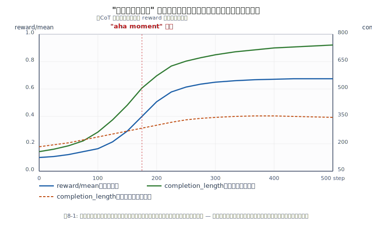

# 第8章 ルールベース報酬と "あはもーめんと"

> **この章の立ち位置**
> 第7章で GRPO という **更新アルゴリズム** を学びました。
> ですが、RL は **報酬設計が9割** です。どの方向に押すかを決めるのが報酬。
> 本章では「学習した RM ではなく、単純な規則だけで推論能力が伸びる」という
> R1-Zero の核心アイデアと、そこで観察された自発的な自己修正（"aha moment"）を扱います。

R1-Zero は **SFT なし** で推論能力を獲得した、というのが衝撃的な結果でした。
その秘密は **「報酬のデザイン」** にあります。
本章では、DeepSeek が採用した **ルールベース報酬** の中身と、
学習中に自発的に現れる **自己反省行動（"aha moment"）** を整理します。

> 💡 **"創発 (emergence)" の定義**
> 本書で「創発する」と言うとき、それは魔法ではなく
> **「単純な局所ルールから、予想以上に高次の振る舞いが生まれる現象」** を指します。
> 例: 報酬が「答えの一致」だけなのに、モデルが試行錯誤と自己修正を始める。
> 観察された **事実** と、それに対する **解釈** は別物であることに注意してください（後述 8.4 節）。

## 8.1 報酬モデルの困難さ

第6章で見たように、RLHF では **学習した報酬モデル（RM）** を使います。
しかし RM には以下の弱点があります。

1. **reward hacking**: RM を騙すような出力を方策が見つけてしまう
2. **バイアス**: RM は人間の好みに沿うが、数学的正しさは保証しない
3. **訓練に追加コスト**: 好みデータを人手で集める必要がある

とくに推論タスクでは、「正しい答えかどうか」は **客観的に判定できる**。
ならばニューラルな RM ではなく、**ルールそのものを報酬** にすればよい、というのが R1 の発想です。

## 8.2 R1-Zero の 2 つの報酬

DeepSeek-R1 論文によれば、R1-Zero の報酬は次の 2 種類の和として設計されています。

### 8.2.1 正解報酬 (Accuracy Reward)

- 数学問題: 最終解答が正解と一致するか（整数・数式の等価チェック）
- コード問題: テストケースに通るか（sandbox 実行）
- 論理推論: 論理的に正しいか（真理値比較）

数学の答えを `\boxed{...}` 形式に出させ、正規表現で抜き出して数値比較するのが一般的です。

```python
import re
def math_accuracy_reward(completion, gold_answer):
    m = re.search(r"\\boxed\{([^}]*)\}", completion)
    if m is None:
        return 0.0
    pred = m.group(1).strip()
    return 1.0 if normalize(pred) == normalize(gold_answer) else 0.0
```

### 8.2.2 書式報酬 (Format Reward)

モデルの出力を **`<think>...</think>回答`** という形式に誘導する報酬です。

- `<think>` と `</think>` がそれぞれ 1 回だけ出るか
- その後に実際の回答が続くか

```python
FORMAT_RE = re.compile(r"^<think>.*?</think>\s*.+$", re.DOTALL)

def format_reward(completion):
    return 1.0 if FORMAT_RE.match(completion) else 0.0
```

### 合成

合成の仕方は様々ですが、一例として

```python
def total_reward(completion, gold):
    return math_accuracy_reward(completion, gold) + 0.2 * format_reward(completion)
```

のように **正解報酬を主、書式報酬を補助** にするのが典型。
書式を重視しすぎると「形だけ正しくて中身は空っぽ」な回答に収束します。

> ⚠️ **空虚な CoT の例**
> 書式報酬を主にしすぎると、こんな応答に最適化されることがあります。
>
> ```
> <think>計算します。</think>42
> ```
>
> タグの形式は満たしていますが、思考過程は実質ゼロ。
> ルールはすべて満たすのに中身が空虚、という落とし穴は、報酬設計全般で
> **"報酬ハック (reward hacking)"** と呼ばれます。
> これを避けるには、**正解報酬の重みを十分に大きく** し、
> 書式報酬はあくまで補助に留めるのが鉄則です。

## 8.3 コード問題の場合：実行報酬

競技プログラミング系データセット（CodeForces-CoTs）では、**テストケース実行結果** そのものが報酬になります。

Open-R1 では **E2B / Morph sandbox** という実行環境と統合され、

```python
def code_reward(code, tests):
    pass_rate = run_in_sandbox(code, tests)   # 0.0 〜 1.0
    return pass_rate
```

のように 0〜1 の連続値を返します。実行に時間がかかるので非同期で並列に走らせます。

## 8.4 なぜ "創発" するのか — あはもーめんと

論文中で最も印象的なのが、R1-Zero の学習曲線の中で **思考の長さが徐々に伸び**、
**自己修正のフレーズ** が自発的に現れる現象です。

> モデル出力の一例（日本語化）
> > ちょっと待って、さっきの計算は間違っているかもしれない。もう一度確かめよう…

### 観測された事実 と 解釈 を分ける

議論を正確にするため、2つを分けて書きます。

| | 内容 |
|---|---|
| **観測事実** | 学習が進むにつれて (a) 生成長が伸び、(b) "Wait, let me reconsider..." 等の自己修正フレーズが頻度を増して現れる |
| **一般的な解釈** | 正解率を上げるパターンが強化されるうちに、**メタ認知的に見える振る舞い** が自然に強化された |

解釈は複数あり得ます（例: 単に確率が偏った結果、プロンプト分布のアーティファクト等）。
本書では事実と解釈を分けた上で、**実務的には解釈Aを採る** という立場で進めます。

これは人間が「教え込んだ」ものではなく、
**ルールベース報酬を最大化する過程で自然に発現** しました。

### 「自己修正フレーズの出現」は探索改善の証拠にならない

ここは推論モデルを語るとき最も誤解されやすい点です。

- **必要条件ではない**: "Wait, let me reconsider..." のようなフレーズが出ただけでは、
  モデルが実際に探索をやり直して正答に近づいたかはわからない。
  表現は増えているのに正答率は横ばい、というケースも現実にあります。
- **偽陽性の典型**: 書式報酬の重みが強いと、モデルは「思考らしく見える言い回し」 だけを増やして報酬を稼ぎ、
  本体の推論は改善していない — という状態に最適化され得る（第8.2節の「空虚な CoT」）。

したがって aha moment の観測は、単発のフレーズ検出ではなく、**複数の定量指標を組み合わせて確認** する必要があります。

| より強い証拠 | 何を見るか |
|---|---|
| **正答率の改善** | `reward/mean` や `pass@1` が **`completion_length` と同じタイミングで** 伸びているか |
| **冗長化との切り分け** | 長くなっているのが正答サンプルか不正答サンプルか。不正答だけ長くなっているなら、それは **探索改善ではなく冗長化**。正答時に長い傾向が強まっていれば探索の兆候 |
| **自己修正の痕跡との一致** | 抜き取った正答サンプルに、「最初の式を否定 → 別解 → 正答」といった **途中訂正の軌跡** が伴っているか |
| **書式報酬を外したときの安定性** | 書式報酬を切っても正答率が崩れないか（本当に推論が強化されたなら崩れにくい） |

> ⚠️ **「長い＝良い」ではない**
> `completion_length` 単体は **方向の無い指標** です。
> 「長さと正答率が同期して伸びる」「正答サンプルの方が不正答サンプルより長い」 という
> **条件付きの伸び** を見て初めて、推論が深まっている兆候として読めます。

フレーズが増えた＝推論が深まった、と短絡しないこと。
**第12章のハンズオンでは、`reward/mean` と `completion_length` を併せて見ることを強調** しているのは、ここに由来します。

### なぜ起きるのか？

直感的な説明はこうです。

1. 正解したグループだけ高い報酬 → アドバンテージが正
2. 正解に繋がる思考パターンほど、トークン確率が上がる
3. 「一度書いた途中式を見直す」「別解法を試す」のような自己修正は、
   正答率を上げるので自然と強化される
4. さらにそれを見た RL が同じパターンを **より頻繁に出す** ように学習

つまり、**正解報酬が間接的に「メタ認知」を強化する** のです。

### 学習曲線の見方

典型的な R1-Zero 系の学習では、次の 2 つの指標が **平行して伸びます**。

- ベンチマーク正答率（例: AIME 2024 の pass@1）
- 生成長（`completion_length` の平均）

生成長が伸びずに正答率だけ上がる、あるいはその逆、という現象は
**報酬設計のバグ** を示唆することが多いです。



> 図8-1 では 3 本の曲線を重ねています。
> **青（reward/mean）** と **緑（正答サンプルの長さ）** がほぼ同じタイミングで立ち上がり、
> **橙の点線（不正答サンプルの長さ）** はそれほど伸びない — この「条件付きの伸び」が見えたら
> 探索が深まっている兆候です。橙だけが伸びている場合は **冗長化（reward hacking 寄り）** を疑ってください。

## 8.5 R1-Zero の限界と R1 への展開

R1-Zero には以下の弱点があります。

- 思考が **英語と中国語が混じる**（多言語混在）
- **読みにくい**、冗長すぎる
- 指示追従性（役立ち度）が低い

これを解消するために、R1 では

1. **Cold-start SFT**: 数千件の整った CoT で予熱
2. **Reasoning RL**（R1-Zero と同じ GRPO）
3. **Rejection Sampling + SFT**: 正答した CoT を大量にサンプルして SFT
4. **最終 RL**: 役立ち度・無害性の RM を混ぜて再度 GRPO

という多段階パイプラインを組みます。Open-R1 の Step 3 がこれを再現する目標です。

## 8.6 Open-R1 における報酬関数

`open-r1/src/open_r1/rewards.py` には以下のような関数が並んでいます（概要）:

- `accuracy_reward` — 数学の答え一致
- `format_reward` — `<think>` タグの形式
- `reasoning_steps_reward` — ステップ区切り（`Step 1:` ...）が含まれるか
- `cosine_reward` — **短い CoT を奨励** する工夫
- `repetition_penalty` — 自己ループに入ったら減点
- `code_reward` — sandbox 実行

これらを組み合わせることで、**性能と可読性を両立** した推論モデルを目指します。

## 8.7 報酬設計のコツ

| 狙い | 報酬設計 |
|---|---|
| 正解率を上げる | 二値 or 連続の正解報酬を主成分に |
| 出力を整える | `<think>` タグ等の書式報酬を補助成分に |
| 冗長さを抑える | 長さペナルティや余弦重み |
| 自己ループを防ぐ | 繰り返しペナルティ |
| 安全性 | 有害出力を明示減点（ただし過剰な抑制に注意） |

> ⚠️ **Warning**  報酬に **たくさんのルールを足しすぎる** と、
> モデルは **規則を満たすだけの小手先の出力** に最適化してしまいます。
> 「何が本当に大事か」を最低限のルールで表現することが大切です。

## 8.8 まとめ

- R1-Zero の報酬は **正解報酬 + 書式報酬** の 2 本柱
- ルールベース報酬は RM バイアスを避けられる
- GRPO と組み合わせることで、**自己修正などのメタ認知が創発**
- Open-R1 には豊富な報酬関数実装があり、そのまま再利用できる

## 🧪 手を動かしてみよう

1. 「2 桁 × 2 桁の掛け算」の問題を 100 問自動生成し、
   正解報酬 + 書式報酬で `Qwen2.5-0.5B-Instruct` に GRPO をかけてみましょう。
   まず報酬なしで何問正解するか測り、学習後と比較してください。
   [`examples/ch08/multiply_grpo.py`](../examples/ch08/multiply_grpo.py)

2. `format_reward` の正規表現を自作して、`<think>` 2 回ブロックも検出するようにしてみましょう。

3. Open-R1 の `rewards.py` を読み、`cosine_reward` が **なぜ短い CoT を奨励できるのか**、
   式を追って説明してください。

---

[← 第7章 GRPO](ch07.md) ｜ [→ 第9章 蒸留](ch09.md)
