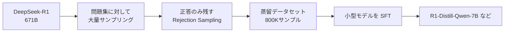

# 第9章 蒸留で小さな推論モデルを作る

R1 の本体は 671B パラメータで、手元の GPU では動かせません。
しかし **R1-Distill-Qwen-7B** は、**7B** のサイズで
 GPT-4o を多くのベンチマークで上回ります。
本章ではこの **蒸留 (distillation)** の仕組みを学び、
Open-R1 が Step 1 として取り組む **R1-Distill の再現** の背景を理解します。

## 9.1 知識蒸留のおさらい

**知識蒸留 (Knowledge Distillation, KD)** は、2015年に Hinton らが提案した
「巨大なモデル（教師）の知識を小さなモデル（生徒）に移す」 フレームワークです。

古典的には教師と生徒のソフト分布 $p_T, p_S$ を近づける:

$$
\mathcal{L}_{\text{KD}} = \mathrm{KL}\big(p_T(\cdot|x) \,\|\, p_S(\cdot|x)\big)
$$

LLM の場合、ロジット全体を取り出して比較するとメモリ・通信が膨大なので、
実用上は **「教師が出力したテキスト」 をそのまま SFT データに使う** ことが主流です。
これを文献では **sequence-level distillation**、業界では単に **"Distill"** と呼びます。

## 9.2 R1-Distill の具体的な作り方



1. **問題プール** を用意: 数学（NuminaMath）・コード（競プロ）・STEM QA
2. **R1 で応答を大量生成**: 各問題に対して複数サンプル
3. **Rejection Sampling**: 正解のものだけ残す（ルールベース検証）
4. **残ったデータ** を SFT データとして保存（`<think>` タグ付き CoT を含む）
5. **Qwen2.5 / Llama-3 ベースモデル** に SFT

DeepSeek の公式 Distill は約 **800K サンプル**（比率: 数学 ≥ 60%、コード 20%、その他）で作られたとされます。

## 9.3 Open-R1 のデータ再構築

Open-R1 が Step 1 で作ったのが **Mixture-of-Thoughts** と呼ばれる 350K件の検証済み推論データで、
以下が含まれます。

| データセット | サンプル数 | 内容 |
|---|---|---|
| OpenR1-Math-220k | 220K | NuminaMath 問題に R1 の推論軌跡を付加 |
| CodeForces-CoTs | 10K 問題 × 10 解答 = 100K | 競技プログラミング問題+解答 |
| その他 STEM | 30K 程度 | 物理・化学・数学混合 |

全データはルールベース検証を通過しており、**学習に使える品質** が保証されています。

## 9.4 Distill SFT の特殊な工夫

普通の SFT との違いは以下。

### 9.4.1 長い `max_seq_length`

R1 の CoT は平均でも 数千トークン、長いもので 32K を超えます。
Open-R1 では `max_seq_length=32768` に設定し、途中で切られないようにします。

### 9.4.2 `<think>` タグは必ず残す

教師の思考過程がそのまま教育資源。
データ前処理時に `<think>...</think>` を取り除かないよう注意が必要です。

### 9.4.3 packing

多くの CoT は短いので、**パッキング（複数サンプルを 1 シーケンスに詰める）** で GPU 効率を上げます。

```python
# trl SFTTrainer の packing=True が自動でこれをやってくれる
args = SFTConfig(packing=True, max_seq_length=32768)
```

### 9.4.4 学習率

ベースモデル（Qwen2.5）の微調整なので比較的小さい学習率（1e-5 〜 5e-5）。
Open-R1 は `learning_rate: 4e-5` を採用。

## 9.5 蒸留モデルの性能（Open-R1 報告）

| モデル | AIME 2024 pass@1 | MATH-500 | 備考 |
|---|---:|---:|---|
| Qwen2.5-7B-Instruct | 13% | 79% | ベースライン（指示調整済） |
| DeepSeek-R1-Distill-Qwen-7B | 55% | 92% | 公式 Distill |
| **OpenR1-Distill-7B** | 51% | 91% | Open-R1 再現 |

※ 数値は執筆時点の報告値。誤差を含みます。

**GPT-4o の AIME 2024 pass@1 は 13% 程度** であるのと比べると、
7B の小型モデルでも推論特化すれば o1 / R1 クラスに肉薄することがわかります。

## 9.6 蒸留と RL の関係

面白いのは「蒸留だけで R1 級に近づけるなら RL いらないのでは？」という疑問です。
論文の結論はこうです。

> 大型モデルを **RL** で作り、その知識を **蒸留で移す** のが効率的

つまり、

- 小型モデルだけで RL しても上限は伸びない（問題を解けない）
- 大型モデルで RL → 正解 CoT → 蒸留、の方が小型最終モデルが強い

この観察は、今後の研究方針にも大きな影響を与えています。

## 9.7 Open-R1 の蒸留再現レシピ

`open-r1/recipes/OpenR1-Distill-7B/sft/config.yaml` の重要項目:

```yaml
model_name_or_path: Qwen/Qwen2.5-7B-Instruct
dataset_name: open-r1/Mixture-of-Thoughts
learning_rate: 4.0e-5
per_device_train_batch_size: 2
gradient_accumulation_steps: 8
num_train_epochs: 3
max_seq_length: 32768
packing: true
bf16: true
gradient_checkpointing: true
deepspeed: configs/zero3.json
```

ハードウェア: **8× H100 80GB** を想定。学習時間は **数時間〜1日** 程度。

## 9.8 まとめ

- LLM の蒸留は **「教師テキストで小型モデルを SFT する」** のが主流
- R1-Distill は 800K 件の検証済み CoT を使って Qwen/Llama を SFT したもの
- Open-R1 は Mixture-of-Thoughts（350K件）で再現中
- 長文 + packing + bf16 + ZeRO-3 がポイント

## 🧪 手を動かしてみよう

1. Hugging Face Hub から `open-r1/Mixture-of-Thoughts` を 100 件だけ読み込み、
   **`<think>` タグの有無、CoT の平均トークン長、応答の平均文字数** を集計してみましょう。

2. 自分で 10 問程度の算数問題を用意し、
   DeepSeek-R1-Distill-Qwen-1.5B に解かせて得た応答から、
   **正解だけ** を残す Rejection Sampling スクリプトを書いてみてください。
   [`examples/ch09/reject_sample.py`](../examples/ch09/reject_sample.py)

3. 「蒸留だけ」と「GRPO のみ」で同じベース（Qwen2.5-0.5B）を学習したモデルを比較する
   **実験計画** を、1ページ程度の設計書にまとめてみましょう（実行は任意）。

---

[← 第8章 ルールベース報酬](ch08.md) ｜ [→ 第10章 データセットと評価](ch10.md)
